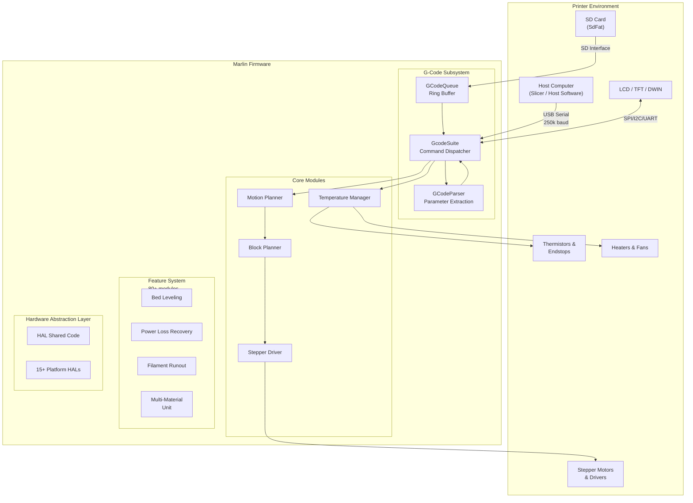
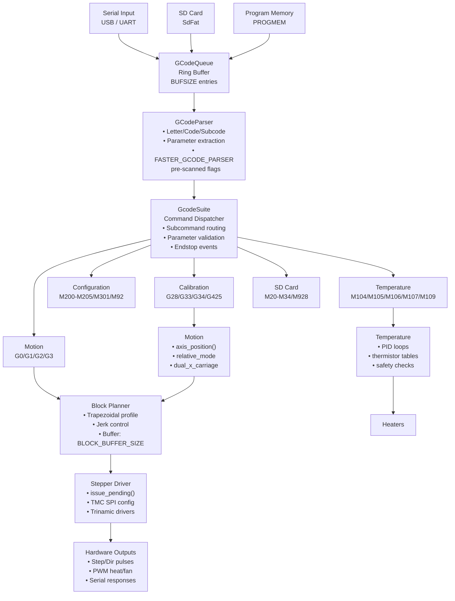

# Marlin 3D Printer Firmware

> This file consolidates the project summary (`docs/project-summary.md`) into the top-level agent reference. It is the canonical orientation document for the whole repo. Per-HAL working notes live in `Marlin/src/HAL/<FAMILY>/AGENTS.md` (e.g. `Marlin/src/HAL/AT32/AGENTS.md`).

## 1. Executive Summary

Marlin is an open-source firmware for 3D printers, written in C/C++ and built on the Arduino framework via PlatformIO. It sits between a host computer (running slicer software) and the printer's hardware, translating G-code movement commands into precise stepper motor control, temperature regulation, and peripheral management. The firmware supports 15+ microcontroller platforms (STM32, AVR, ESP32, RP2040, and more), 400+ pin configuration files across 24 board families, and a modular feature system with 80+ enable/disable features. At over 2,500 source files, Marlin is one of the most widely deployed 3D printer firmware projects in the world, licensed under GPL v3.0.

## 2. Architecture Overview

Marlin follows a layered embedded firmware architecture organized around a Hardware Abstraction Layer (HAL), a G-code command processing pipeline, a set of core motion/thermal modules, and a rich feature system. The firmware's singleton entry point is the `Marlin` class (`MarlinCore`), which manages global state and the main control loop.



The firmware communicates with the host via serial at 250,000 baud (configurable), receiving G-code commands line-by-line. Commands are queued in a circular buffer (`GCodeQueue::ring_buffer`), parsed by `GCodeParser`, and dispatched by `GcodeSuite` to category-specific handlers (motion, temperature, configuration, calibration, etc.). The core modules handle the low-level real-time tasks: the planner generates motion blocks with jerk control and acceleration profiling, the stepper driver issues pulse trains, and the temperature manager runs PID loops on thermistor inputs.

### Supported Hardware Platforms

| Platform Family | MCUs | Architecture | Notes |
| --- | --- | --- | --- |
| STM32 (various) | STM32F0, F1, F4, F7, H7, G0 | ARM Cortex-M | Primary 32-bit target |
| AVR | ATmega2560, ATmega1280, AT90USB | 8-bit AVR | Legacy support |
| ESP32 | ESP32-S3, ESP32-S2 | Xtensa/RISC-V | WiFi/BLE capability |
| SAMD | SAMD21, SAMD51 | ARM Cortex-M0+/M4 | Adafruit Feather M4 |
| RP2040 | RP2040, RP2350 | ARM Cortex-M33 | Raspberry Pi Pico |
| LPC | LPC1768, LPC1769 | ARM Cortex-M3 | RAMBo, Melzi boards |
| GD32 | GD32F1, GD32F3 | ARM Cortex-M3 | GigaDevice clones |
| HC32 | HC32F4 | ARM Cortex-M4 | JCEC chips |
| AT32 | AT32F4 | ARM Cortex-M4 | Artery Tek |
| Teensy | 3.1/3.2, 3.5/3.6, 4.0/4.1 | ARM Cortex-M4/M7 | PJRC boards |
| Linux Simulator | x86/x64 | Native | CI/testing |
| Native Simulator | Any | Native | Unit testing |

## 3. Processing Pipeline

The G-code processing pipeline follows a well-defined flow from input ingestion through parsing, dispatch, and hardware actuation.



### Key Pipeline Components

**GCodeQueue** — A circular ring buffer (`RingBuffer`) that holds up to `BUFSIZE` G-code command strings. Commands enter via three injectors: serial input (USB/UART), SD card file reading, and in-firmware injected commands (PROGMEM). The queue's `advance()` method pops the next command and hands it to the parser.

**GCodeParser** — Parses a single G-code line, extracting the command letter (G/M/T), code number, subcode, and all parameter values (X, Y, Z, E, F, S, P, etc.). When `FASTER_GCODE_PARSER` is enabled, the parser pre-scans all parameters into a flags array for O(1) lookups.

**GcodeSuite** — The command dispatcher singleton. Each G/M code maps to a handler method within this class. Commands are routed to category subdirectories under `src/gcode/` (e.g., `motion/`, `temp/`, `config/`, `calibrate/`). The suite also handles pre- and post-command hooks for endstop events, buffer monitoring, and inactivity shutdown.

## 4. Core Components

### 4.1 Firmware Entry Point

The firmware lifecycle is managed by `MarlinCore.cpp` (~1,777 lines), structured around Arduino's `setup()` and `loop()` functions:

- **`setup()`** — Initializes HAL pins, serial ports, all modules (stepper, temperature, motion, planner, settings), features (runout detection, power loss recovery, LEDs), and the UI subsystem. Each initialization block is wrapped in `SETUP_RUN()` for debug logging in dev mode.
- **`loop()`** — Runs continuously (infinite loop on AVR, structured loop on 32-bit platforms). Each iteration calls `marlin.idle()`, processes the G-code queue, checks power-off timers, and handles endstop events.

### 4.2 Singleton Architecture

Global state is managed through singletons:

| Singleton | File | Responsibility |
| --- | --- | --- |
| `marlin` | `MarlinCore.cpp/h` | Global state machine, inactivity management, kill/suicide, heatup waits |
| `gcode` | `gcode/gcode.cpp` | G-code command dispatch |
| `queue` | `gcode/queue.h` | Command queue ring buffer |
| `planner` | `module/planner.cpp` | Motion block buffer and trapezoidal profiling |
| `stepper` | `module/stepper.cpp` | Step pulse generation and TMC driver config |
| `thermalManager` | `module/temperature.cpp` | PID loops, thermistor reading, safety monitoring |
| `card` | `sd/cardreader.cpp` | SD card file system operations |
| `ui` | `lcd/marlinui.cpp/h` | LCD/UI state machine and menu system |

### 4.3 Module System

The `module/` directory contains the core motion and thermal management classes:

| Module | File | Description |
| --- | --- | --- |
| **Motion** | `motion.h/cpp` | High-level axis positioning, coordinate transforms, joint interpolation |
| **Planner** | `planner.h/cpp` | Block buffer, trapezoidal velocity profiling, junction deviation |
| **Stepper** | `stepper.h/cpp` | Step pulse generation, direction control, TMC Trinamic SPI configuration |
| **Temperature** | `temperature.h/cpp` | PID autotune (M303), thermistor tables, hotend/bed/heater management |
| **Endstops** | `endstops.h/cpp` | Endstop interrupt handling, homing logic, soft endstops |
| **Probe** | `probe.h/cpp` | Bed probing (G30, G31/G32, G38, bltouch), Z-offset management |
| **Settings** | `settings.h/cpp` | EEPROM persistence, configuration storage and retrieval |
| **PrintCounter** | `printcounter.h/cpp` | Print time, filament usage, and job statistics |
| **Servo** | `servo.h/cpp` | Servo control for solenoids, lid mechanisms |
| **Delta/Scara/Polar** | `delta.h`, `scara.h`, `polar.h` | Kinematic transforms for non-Cartesian printers |
| **Tool Change** | `tool_change.h/cpp` | Multi-extruder tool switching, hotend offset, PTFE purge |

### 4.4 Feature System

The `feature/` directory contains 80+ optional modules, each gated by a `#if ENABLED(FEATURE_NAME)` preprocessor check:

**Motion Features:** Linear Advance (`linearadvance`), Pressure Advance, Adaptive Multi-Axis Stepping, Direct Stepping, Bresenham acceleration, Resonance Compensation, X-Axis Twist Correction, Z-Stepper Alignment, Backlash Compensation.

**Thermal Features:** Automatic PID Tuning (M303), Thermal Protection, Probe Temperature Compensation, Mixed Extruder (`mixing`), Bowden/Direct Drive Retraction (`fwretract`).

**Peripheral Features:** Power Loss Recovery (`powerloss`), Filament Runout Detection (`runout`), Ethernet Connectivity (`ethernet`), RS485 Communication (`rs485`), MMU/Multi- Material Unit (`mmu`, `mmu3`), Solenoid Control (`solenoid`), Spindle/Laser (`spindle_laser`), Case Lights (`caselight`), LED Color Control (`leds`).

**UI Features:** Touch Screen (`touch`), LVGL TFT UI (`mks_ui`), DWIN Display (`dwin`), Extensible UI (`extui`), Password Protection (`password`), Joystick Input (`joystick`).

**Bed Leveling:** Unified Bed Leveling (UBL), Manual Bed Leveling (MBL), Automatic Bed Leveling (ABL), G26 Mesh Validation, G35 Auto Bed Leveling, Bed Level Visualizer.

## 5. G-Code Command Reference

Marlin implements 100+ G-code commands organized into 14 categories under `src/gcode/`:

| Category | Directory | Key Commands | Description |
| --- | --- | --- | --- |
| **Motion** | `motion/` | G0, G1, G2, G3, G5, G6, G80, M400, M290 | Linear/arc moves, rapid moves, dwell, wait, jog |
| **Temperature** | `temp/` | M104/M105/M106/M107/M109, M140/M190, M303 | Hotend/bed temp set/read, fan control, PID autotune |
| **Configuration** | `config/` | M200-M205, M301, M92, M43, M218, M217 | Extruder steps, accel/jerk, PID, hotend offset, bowden length |
| **Calibration** | `calibrate/` | G28, G33, G34, G425, M48, M566, M665 | Home, delta calibration, nozzle purge, backlash, bellows |
| **Geometry** | `geometry/` | G17-G19, G53-G59, G92, M206, M428 | Plane selection, coordinate systems, position reset, offsets |
| **Control** | `control/` | M17/M18/M84, M80/M81, M3-M5, M7-M9, T | Enable axes, power, spindle, tool select, feedrate/extruder units |
| **Probe** | `probe/` | G30, G31/G32, G38, M851, M401/M402, M102 | Bed probe, probe type, probe actions |
| **SD Card** | `sd/` | M20-M34, M928, M1001, M1003 | File listing, select, start, stop, abort, load, save |
| **LCD** | `lcd/` | M0, M1, M73, M117, M145, M250, M300 | Pause, progress, message, color, beep |
| **Host** | `host/` | M16, M110, M113, M114, M115, M118, M119, M154, M360, M876 | Line numbers, machine info, endstop report, kinematic config |
| **EEPROM** | `eeprom/` | M500, M501, M502, M503, M504 | Save/load/reset/settings EEPROM operations |
| **Stats** | `stats/` | M31, M75-M78 | Print time, filament used, errors, buffer stats |
| **Units** | `units/` | G20/G21, M82/M83, M149 | mm/inch, extrusion mode, temp unit display |
| **OTA** | `ota/` | M936 | Over-the-air firmware update |

## 6. Infrastructure & Deployment

### 6.1 Build System

Marlin uses PlatformIO as its primary build system, configured via `platformio.ini`:

- **Framework**: Arduino (via PlatformIO)
- **Build flags**: `-g3 -D__MARLIN_FIRMWARE__ -DNDEBUG -fsingle-precision-constant`
- **Source filter**: Dynamic inclusion/exclusion of files based on target board via pre-build scripts (`configuration.py`, `common-dependencies.py`, `preflight-checks.py`)
- **Include directory**: `Marlin/src/`
- **Board definitions**: Custom PlatformIO board definitions in `buildroot/share/PlatformIO/boards/`

### 6.2 Configuration System

Configuration is managed through a layered preprocessor conditional system:

1. **`Configuration.h`** — User-editable hardware and feature configuration
2. **`Configuration_adv.h`** — Advanced/experimental feature toggles
3. **`Version.h`** — Build version, machine name, website URL
4. **`inc/Conditionals-*.h`** — Auto-generated feature flags derived from Configuration.h
5. **`inc/MarlinConfig.h`** — Prefix header including all conditionals, types, and sanity checks

The conditional system ensures that only enabled features compile, minimizing firmware footprint for resource-constrained 8-bit platforms.

### 6.3 CI/CD Pipeline

GitHub Actions workflows run on every pull request and push:

| Workflow | Purpose |
| --- | --- |
| `ci-build-tests.yml` | Compiles Marlin for all supported boards (matrix strategy) |
| `ci-unit-tests.yml` | Runs C++ unit tests on the native simulator |
| `ci-validate-boards.yml` | Validates board pin configurations |
| `ci-validate-pins.yml` | Checks for missing/invalid pin definitions |
| `ci-validate-lines.yml` | Validates line count limits for 8-bit boards |
| `auto-label.yml` | Auto-labels PRs by changed paths |
| `check-pr.yml` | PR quality checks |

### 6.4 Docker Build Environment

A Dockerfile (`docker/Dockerfile`) provides a reproducible build environment:

```dockerfile
FROM python:3.11-bookworm
RUN pip install -U platformio PyYaml
RUN pio upgrade --dev
WORKDIR /code
```

### 6.5 Testing

- **Unit tests**: Located in `Marlin/tests/`, run via the Linux native simulator HAL
- **Build tests**: CI compiles against 20+ board targets to catch compile errors
- **Pin validation**: Automated checks for pin conflicts and missing definitions
- **SdFat**: Integrated SdFat library for SD card file operations (Sd2Card, SdBaseFile, SdVolume)

## 7. Extension Patterns

### 7.1 Adding a New Feature

1. Create your feature files in `Marlin/src/feature/` (e.g., `my_feature.h` and `my_feature.cpp`)
2. Add `#define MY_FEATURE` to `Configuration_adv.h`
3. The conditional system in `inc/Conditionals-*.h` will auto-generate `HAS_MY_FEATURE`
4. Use `#if ENABLED(MY_FEATURE)` guards in your code
5. Include your header from `MarlinCore.cpp` under the appropriate `#if ENABLED()` block
6. Register G-code handlers in `gcode/gcode.cpp` or a new category subdirectory

### 7.2 Adding a New G-Code Command

1. Create a new file in the appropriate `src/gcode/<category>/` directory (e.g., `M1000.cpp`)
2. Implement the handler method in the `GcodeSuite` class
3. Register the command in the `process_commands()` method of `GcodeSuite`
4. The command will be dispatched automatically when the parser encounters the letter/code

### 7.3 Adding Board Support

1. Create a new PlatformIO board definition in `buildroot/share/PlatformIO/boards/`
2. Add pin definitions in `Marlin/src/pins/<family>/pins_<board>.h`
3. If the MCU is new, add HAL support in `Marlin/src/HAL/<MCU_FAMILY>/`
4. Update `ini/<platform>.ini` in `platformio.ini`'s `extra_configs`
5. Run `ci-validate-pins.yml` to verify pin assignments

### 7.4 Adding a Display Backend

1. Create backend files in `Marlin/src/lcd/<backend>/`
2. Implement the required display interface (SPI/I2C/UART)
3. Add `#define ULTIPANEL` or display-specific `#define` to `Configuration.h`
4. The LCD subsystem routes through `MarlinUI` to the appropriate backend

## 8. Rules & Anti-Patterns

### Best Practices

- **Conditional compilation**: Always gate platform-specific code with `#if ENABLED()` or `#ifdef ARDUINO_ARCH_XXX`
- **PROGMEM usage**: Store large strings and lookup tables in program memory on 8-bit platforms
- **Interrupt safety**: Use `WAIT`/`NOOP` patterns for stepper ISR synchronization
- **EEPROM limits**: Respect memory constraints — 8-bit boards have limited EEPROM (4KB-8KB)
- **Thread safety**: The main loop and stepper ISR share state — use volatile and careful locking
- **Static analysis**: Use `bug_on()` macros for compile-time assertion checks
- **Code size**: 8-bit targets (AVR) have strict flash limits — enable only necessary features

### Anti-Patterns

- **Don't add features to `Configuration.h`** — use `Configuration_adv.h` for advanced/experimental features
- **Don't modify HAL shared code** without understanding platform implications
- **Don't use floating-point on AVR** without explicit `float` typing — the compiler defaults to single precision
- **Don't block in the main loop** — all long operations must yield to `idle()` or use non-blocking patterns
- **Don't assume 32-bit semantics** — code must compile for both 8-bit AVR and 32-bit ARM
- **Don't hardcode pin numbers** — always use the pin definition headers

## 9. Dependencies

### Build Tools

| Dependency       | Version           | Purpose                    |
| ---------------- | ----------------- | -------------------------- |
| PlatformIO       | Latest dev        | Build system and framework |
| Arduino Core     | Platform-specific | Microcontroller SDK        |
| GCC ARM Embedded | 12.x              | ARM cross-compiler         |
| avr-gcc          | 7.x               | AVR cross-compiler         |

### Libraries (integrated)

| Library    | Purpose                                             |
| ---------- | --------------------------------------------------- |
| SdFat      | SD card file system (Sd2Card, SdBaseFile, SdVolume) |
| u8glib     | OLED/LCD display driver (embedded in HAL)           |
| LVGL       | TFT graphical UI (optional, for MKS UI)             |
| heatshrink | G-code decompression for SD prints                  |

### Platform Libraries

| Platform | Libraries                     |
| -------- | ----------------------------- |
| STM32    | STM32 HAL/LL, STM32duino core |
| AVR      | Arduino AVR core, TimerOne    |
| ESP32    | ESP-IDF components, WiFi      |
| RP2040   | Arduino RP2040 core, PIOasm   |
| Teensy   | Teensyduino core, Bounce2     |
| SAMD     | Arduino SAMD core             |

## 10. Code Structure

```
MarlinFirmware/                  # Repo root (this directory). `cd` here for PlatformIO builds.
├── Marlin/                      # The Arduino "sketch" (application source + config files)
│   ├── Configuration.h          # User hardware configuration
│   ├── Configuration_adv.h      # Advanced/experimental toggles
│   ├── Marlin.ino               # Board-specific entry stub
│   ├── Makefile                 # Alternative build (simulator)
│   ├── Version.h                # Build version, machine name
│   ├── config.ini               # PlatformIO extra config
│   ├── lib/                     # Integrated libraries
│   └── src/                     # Application source (see below)
├── buildroot/                   # Build infrastructure
├── ini/                         # PlatformIO platform configs
├── docs/                        # Project documentation
├── docker/                      # Docker build environment
├── .github/workflows/           # CI/CD pipelines
└── platformio.ini               # Main PlatformIO configuration
```

### Marlin/src layout

```
Marlin/src/
├── MarlinCore.cpp/h         # Firmware entry, setup(), loop(), Marlin singleton
├── core/                    # Core utilities (serial, language, types, mstring)
│   ├── gcode/                   # G-code subsystem
│   │   ├── gcode.cpp/h          # GcodeSuite dispatcher
│   │   ├── parser.cpp/h         # GCodeParser
│   │   ├── queue.cpp/h          # GCodeQueue ring buffer
│   │   ├── motion/              # G0-G6, M290, M400
│   │   ├── temp/                # M104-M109, M140-M193, M303
│   │   ├── config/              # M200-M205, M301, M92, M218
│   │   ├── calibrate/           # G28, G33, G34, G425, M48
│   │   ├── bedlevel/            # G26, G35, G42, M420
│   │   ├── geometry/            # G17-G19, G53-G59, G92
│   │   ├── probe/               # G30-G38, M851, M401
│   │   ├── sd/                  # M20-M34, M928
│   │   ├── lcd/                 # M0, M1, M73, M117
│   │   ├── host/                # M16, M110-M119
│   │   ├── eeprom/              # M500-M504
│   │   ├── stats/               # M31, M75-M78
│   │   ├── units/               # G20/G21, M82/M83
│   │   └── control/             # M3-M5, M7-M9, M17-M85, T
│   ├── module/                  # Core modules
│   │   ├── motion.h/cpp         # Axis positioning, kinematics
│   │   ├── planner.h/cpp        # Block buffer, trapezoidal profiling
│   │   ├── stepper.h/cpp        # Step pulses, TMC drivers
│   │   ├── temperature.h/cpp    # PID, thermistors, safety
│   │   ├── endstops.h/cpp       # Endstop interrupts, homing
│   │   ├── probe.h/cpp          # Bed probing, Z-offset
│   │   ├── settings.h/cpp       # EEPROM persistence
│   │   ├── delta.h/cpp          # Delta kinematics
│   │   ├── scara.h/cpp          # Scara kinematics
│   │   ├── polar.h/cpp          # Polar kinematics
│   │   ├── polargraph.h/cpp     # Polar graph kinematics
│   │   ├── servo.h/cpp          # Servo control
│   │   ├── printcounter.h/cpp   # Print statistics
│   │   ├── tool_change.h/cpp    # Multi-extruder switching
│   │   ├── ft_motion/           # Fine-tune motion
│   │   └── stepper/             # Stepper internals, Trinamic
│   ├── feature/                 # 80+ optional features
│   │   ├── bedlevel/            # UBL, MBL, ABL
│   │   ├── leds/                # LED color control
│   │   ├── mmu/                 # Multi-material unit
│   │   ├── mmu3/                # MMU3 variant
│   │   ├── powerloss.h/cpp      # Power loss recovery
│   │   ├── runout.h/cpp         # Filament runout detection
│   │   ├── pause.h/cpp          # Pause/resume
│   │   ├── mixing.h/cpp         # Mixed extruder
│   │   ├── fwretract.h/cpp      # Firmware retraction
│   │   ├── resonance/           # Resonance compensation
│   │   ├── spindle_laser.h/cpp  # Spindle/laser control
│   │   ├── ethernet.h/cpp       # Ethernet connectivity
│   │   ├── solenoid.h/cpp       # Solenoid control
│   │   ├── password/            # Password protection
│   │   ├── joystick.h/cpp       # Joystick input
│   │   ├── tmc_util.h/cpp       # TMC driver utilities
│   │   └── ...                  # 60+ more features
│   ├── lcd/                     # Display/UI subsystem
│   │   ├── marlinui.h/cpp        # Main UI controller
│   │   ├── HD44780/             # Hitachi HD44780 LCD
│   │   ├── dogm/                # DOGM OLED/LCD
│   │   ├── tft/                 # TFT displays
│   │   ├── tft_io/              # TFT I/O drivers
│   │   ├── dwin/                # DWIN displays
│   │   ├── extui/               # Extensible UI (MKS LVGL)
│   │   ├── menu/                # Menu system
│   │   ├── touch/               # Touch screen
│   │   ├── language/            # Multi-language strings
│   │   └── sovol_rts/           # Sovol RTS display
│   ├── libs/                    # Utility libraries
│   │   ├── bresenham.h          # Bresenham line algorithm
│   │   ├── vector_3.h/cpp       # 3D vector math
│   │   ├── circularqueue.h      # Generic circular queue
│   │   ├── adc/                 # ADC utilities
│   │   ├── heatshrink/          # Decompression
│   │   ├── nozzle.cpp/h         # Nozzle cleaning
│   │   ├── numtostr.h/cpp       # Number-to-string
│   │   ├── hex_print.h/cpp      # Hex printing
│   │   ├── crc16.h/cpp          # CRC-16 calculation
│   │   ├── stopwatch.h/cpp      # Stopwatch utility
│   │   ├── least_squares_fit.h  # Least squares fitting
│   │   └── ...                  # 15+ utility libs
│   ├── sd/                      # SD card subsystem
│   │   ├── cardreader.h/cpp     # Card reader interface
│   │   ├── SdFat*               # SdFat library (file system)
│   │   ├── disk_io_driver.h     # Disk I/O abstraction
│   │   └── usb_flashdrive/      # USB flash drive support
│   ├── pins/                    # Pin definitions (400+ files)
│   │   ├── pins.h               # Pin inclusion router
│   │   ├── ramps/               # Ramps board family
│   │   ├── mega/                # Mega board family
│   │   ├── rambo/               # Rambo board family
│   │   ├── sanguino/            # Sanguino board family
│   │   ├── stm32f1/             # STM32F1 boards
│   │   ├── stm32f4/             # STM32F4 boards
│   │   ├── stm32f7/             # STM32F7 boards
│   │   ├── stm32h7/             # STM32H7 boards
│   │   ├── stm32g0/             # STM32G0 boards
│   │   ├── stm32f0/             # STM32F0 boards
│   │   ├── sam/                 # SAM boards
│   │   ├── samd/                # SAMD boards
│   │   ├── rp2040/              # RP2040 boards
│   │   ├── lpc1768/             # LPC1768 boards
│   │   ├── lpc1769/             # LPC1769 boards
│   │   ├── teensy2/             # Teensy 2.x boards
│   │   ├── teensy3/             # Teensy 3.x boards
│   │   ├── teensy4/             # Teensy 4.x boards
│   │   ├── esp32/               # ESP32 boards
│   │   ├── gd32f1/              # GD32F1 boards
│   │   ├── gd32f3/              # GD32F3 boards
│   │   ├── hc32f4/              # HC32F4 boards
│   │   ├── at32f4/              # AT32F4 boards
│   │   └── native/              # Native/simulator
│   ├── HAL/                     # Hardware Abstraction Layer
│   │   ├── HAL.h                # HAL interface definition
│   │   ├── platforms.h          # Platform selection
│   │   ├── shared/              # Cross-platform HAL code
│   │   │   ├── HAL.cpp/h        # Shared HAL implementation
│   │   │   ├── Delay.h          # Safe delay function
│   │   │   ├── eeprom_api.h     # EEPROM API
│   │   │   ├── cpu_exception/   # Exception handling
│   │   │   └── backtrace/       # Stack backtrace
│   │   ├── STM32/               # STM32 platform HAL
│   │   ├── AVR/                 # AVR platform HAL
│   │   ├── ESP32/               # ESP32 platform HAL
│   │   ├── DUE/                 # Arduino Due HAL
│   │   ├── SAMD21/              # SAMD21 HAL
│   │   ├── SAMD51/              # SAMD51 HAL
│   │   ├── RP2040/              # RP2040 HAL
│   │   ├── LPC1768/             # LPC1768 HAL
│   │   ├── GD32_MFL/            # GD32 HAL
│   │   ├── HC32/                # HC32 HAL
│   │   ├── AT32/                # AT32 HAL
│   │   ├── TEENSY31_32/         # Teensy 3.1/3.2 HAL
│   │   ├── TEENSY35_36/         # Teensy 3.5/3.6 HAL
│   │   ├── TEENSY40_41/         # Teensy 4.0/4.1 HAL
│   │   ├── STM32F1/             # STM32F1 HAL
│   │   ├── LINUX/               # Linux simulator HAL
│   │   └── NATIVE_SIM/          # Native simulator HAL
│   └── tests/                   # Unit tests
│       ├── unit_tests.h/cpp     # Test suite
│       └── *.ini                # Test configurations
├── docs/                        # Project documentation
│   ├── AGENTS.md                # This document
│   └── diagrams/                # Architecture diagrams
│       ├── high-level-architecture.drawio
│       ├── processing-pipeline.drawio
│       └── component-relationships.drawio
├── buildroot/                   # Build infrastructure
│   ├── share/PlatformIO/        # PlatformIO board definitions & scripts
│   ├── test-gcode/              # G-code test files
│   └── tests/                   # Build test configurations
├── ini/                         # PlatformIO platform configs
│   ├── avr.ini, due.ini, esp32.ini
│   ├── stm32-common.ini, stm32f1.ini, stm32f4.ini
│   ├── stm32f7.ini, stm32h7.ini, stm32g0.ini
│   ├── samd21.ini, samd51.ini
│   ├── raspberrypi.ini, teensy.ini
│   ├── at32.ini, gd32.ini, hc32.ini
│   ├── lpc176x.ini, native.ini
│   ├── features.ini, renamed.ini
│   └── stm32f1-maple.ini
├── test/                        # Root-level test configurations
├── docker/                      # Docker build environment
├── .github/workflows/           # CI/CD pipelines
└── platformio.ini               # Main PlatformIO configuration
```

---

_This document was consolidated from `docs/project-summary.md` into the top-level `AGENTS.md` on 2026-07-11 to serve as the canonical repo orientation reference. It reflects the codebase as of the bugfix-2.1.x branch._
