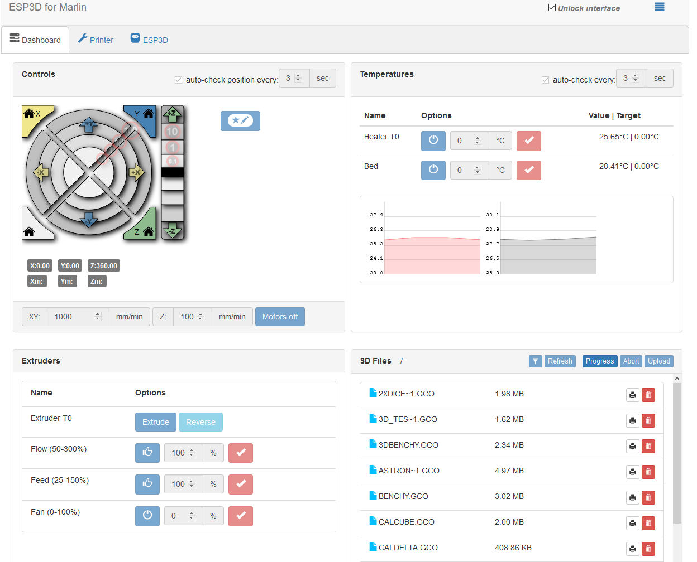

# Marlin 3D Printer Firmware for Delta QQS-Pro

__Not for production use. Use with caution!__

## Marlin 2.0 Bugfix Branch
 Update Marlin-BugFix 20201030

  -Last correction for Black screen in UI Color

  -Correction thermal protection hysterisis.

  -Remove part for TMC2209 UART HardwareSerial
  
  - Add comments into definition_pins file.

 Update Marlin-BugFix 20201022
 
  -Integration in the Marlin firmware of the HISPEED motherboard and configuration files for the QQS-Pro.
  
  -Fixed Deploy/Stow ZProbe
  
  -Fixed for users using E3Dv6 hotend
  
  -Others TIPS(QQS_Config.h, Quick calibration 6, Menu management of NeoPixel leds, etc).

## Marlin 2.0.7 
 Update 2020-10-01
 
## Marlin 2.0 Bugfix Branch
 Update Marlin-BugFix 20200905

  ## Validate:

Firmware for QQS-Pro with A4988.

Firmware for QQS-Pro with TMC2208_Standalone

Firmware for QQS-Pro with TMC2208_UART

With activate parts:

[PID_EDIT_MENU]
[DELTA_CALIBRATION_MENU ]
[POWER_LOSS_RECOVERY]
[FILAMENT_RUNOUT_SENSOR]
[PAUSE_BEFORE_DEPLOY_STOW]

No validate:
-TMC2209

  ## Exemple: 

8CWBL-Robin_mini.bin =>  (8)TMC2208 standalone - (C)UI Marlin - (W)Module Wifi - (B)Extruder BMG - (L)LinearAdvance  

Caption:

  ### /*------Drivers--------*/
(S) A4988

(8) TMC2208

(9) TMC2209

(U8) TMC2208_UART with no module ESP12.

(U8+) TMC2208 (XYZ) + Choice for E0 (A4988,TMC220x) 

(U9+) TMC2209 (XYZ) + Choice for E0 (A4988,TMC220x)

  ### /*------Modules--------*/
(W) Module ESP8266/ESP12

(T) Extruder Titan

(B) Extruder BMG

(N) NeoPixel

  ### /*-------Options UI TFT--------*/
(F) UI STANDARD 

(C) UI MARLIN 

(I) UI MKS

  ### /*-------Others options in firmware----*/ 
(A) BED_LEVELING_BILINEAR

(U) BED_LEVELING_UBL

(L) Linear Advance (Possible Bug with BabyStep and TMC)

 ## For the Wifi Module (MKS_Wifi):

Put the firmware (MksWifi.bin) on the scard with the firmware FLSUN (Robin_mini.bin)
1) Flash original firmware + original mkswifi 
2) Flash original firmware + Custum mkswifi 
3) Inspect the Wifi Access Point and if you see: AP-FLSUN => Flash ok 
4) Flash Marlin 
to run the update of Mks_Wifi or You also can do by web page of the AP (192.168.4.1).

 ### Initial Configuration after the flash.
1. Open device web page on the AP connected device
Accept Captive portal redirect or
2 Open a web browser and navigate to http://192.168.4.1
3. Upload 2 files in the "zip' and configure the device to your choosing
4. I recommend changing to Station mode and connecting to your home/office Wifi instead of staying in AP mode
5 You may want to change the Baud rate
6. You can change to DHCP, or at the very least setup a Static IP you are familiar with.

More information: [ESP3Dv2.1](https://github.com/luc-github/ESP3D/wiki/Install-Instructions)

Once reconnected to the module's web page, you must load the two files "index.html.gz"
and "preferences.json" to have the user interface.

Enjoy....🙃

 ## Support my work

  This QQS-Pro porting project for the Marlin firmware was only possible thanks to its supporters, you can participate via
   
   
   
  You can also send me a tip via [Thingiverse](https://www.thingiverse.com/FamStel/about) if you prefer.

 Massive thank you in advance :heart:
