# 1. Marlin 3D Printer Firmware for Delta QQS-Pro and Q5.

  
  
  
  

  [**Group FaceBook**](https://www.facebook.com/groups/120961628750040)

  [**My Posts on Group FB**](https://www.facebook.com/hashtag/deltafoxies/?__gid__=120961628750040)

  

  `__Not for production use.__`
  
  `Use with caution!`

***

- [1.Title](#1-Marlin-3D-Printer-Firmware-for-Delta-QQS-Pro-and-Q5)
  - [1.1. Last News,](#11-Last-news-Marlin-2-Bugfix-Branch)
  - [1.2. Capabilities,](#12-Validate-and-Actived-parts)
  - [1.3. Hardware,](#13-Hardware-for-the-FLSunQ-printers)
  - [1.4. Description of firmware headers.](#14-CAPTION-Firmwares)
- [2. Delta preparation](#2-SETTINGS-THE-PRINTER)
  - [2.1. Delta Calibration,](#21-Delta-Calibration)
  - [2.2. Set the OffSet (Z),](#22-Z_OffSet)
  - [2.3. Levelling (UBL),](#23-Bed-Levelling)
  - [2.4. Refine your printed object dimensions,](#24-DIMENSIONS)
  - [2.5. Perform a PID,](#25-PID)
  - [2.6. Adjust your Extruder.](#26-EXTRUDER)
- [3. Special mods for TMC, Raspberry, LedStrip, etc](#3-SPECIAL-MODS)
  - [3.1. UART mode for 220x,](#31-TMC-with-UART-mode)
  - [3.2. Special mode 2209,](#32-TMC2209-Single-Wire)
  - [3.3. TIPS for Raspberry,](#33-Raspberry)
  - [3.4. Led_Strip, Fans, Convertors, thermal probe,...](#34-Various-assembly)
  - [3.5. Mecanical & Electronic](#35-Mechanical--electronic-precautions)
- [4. The slicer](#4-SLICER-PART)
- [5. Wifi Part](#5-Firmware-Wifi)
- [6. Version History.](#6-Version-History)
***
## 1.1. Last news Marlin 2 Bugfix Branch
  Update Marlin-BugFix 20210228
  - Last fix by Marlin (Serial coms, latency MCU, Preheat leveling, fix Host pause(M876), Improve GCode queue, Preheat menu option, Wifi, etc)
  - New release (binaries and source)
  - Support QQSP/Q5 Stock, TMC and UART mode.
  - **All QQSP features on Q5 and SKR**
  - Update ReadMe.

## 1.2. Validate and Actived parts
### Validate:
  - Firmware for QQS-Pro with A4988/TMC220x_Standalone/TMC220x_UART/TMC2209_UART one-wire.

 With activate parts: 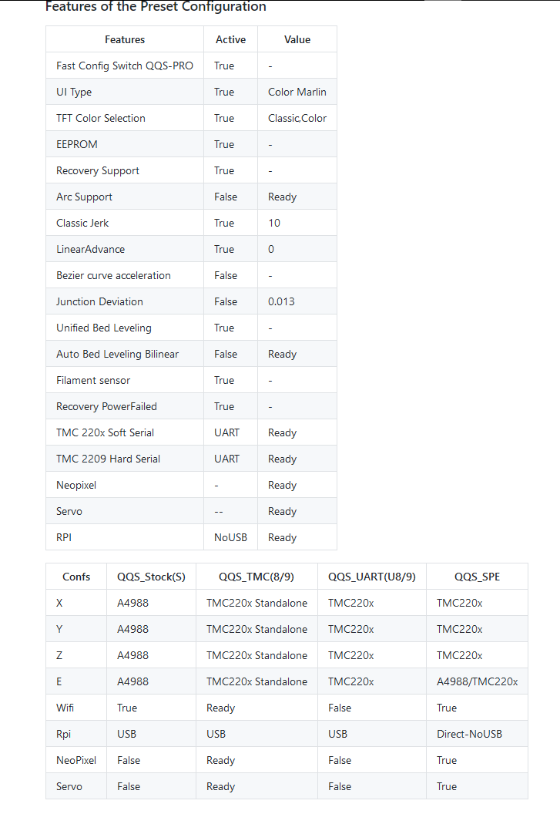

  * [PID_EDIT_MENU]
  * [NATIVE LANGUAGE]
  * [DELTA_CALIBRATION_MENU]
  * [PREHEAT LEVELING]
  * [MULTI_BUILD_MESH]
  * [POWER_LOSS_RECOVERY]
  * [FILAMENT_RUNOUT_SENSOR]
  * [AUTO_BED_LEVELING_UBL]
  * [BABYSTEPPING]
  * [PAUSE_BEFORE_DEPLOY_STOW]
  * [LIN_ADVANCE]
  * [ARC_SUPPORT]
  * [BINARY_FILE_TRANSFER]
  * [UART_MODE_for_TMC/RPI/ESP]

## 1.3. **Hardware for the FLSunQ printers**
  
  * MotherBoards QQS: 
    [HiSpeedv1_&_RobinMini](./HISPEED)
    
    With integrated stepper drivers(A4988)=>(**Sxxx-Robin_mini.bin**)

    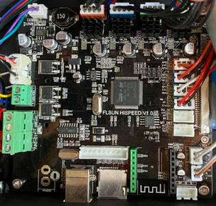
    
    With removable stepper drivers.
    2&3_A4988(Green/Red)=>(**Sxxx-Robin_mini.bin**)
    
    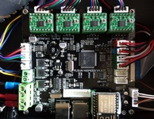 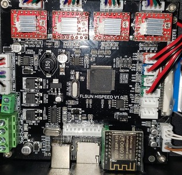
    
    4xTMC2208 MKS =>(**8xxx-Robin_mini.bin**)
    
    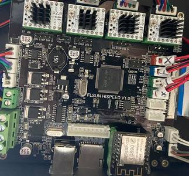
  
  * Others Micro Steppinp Drivers
  
    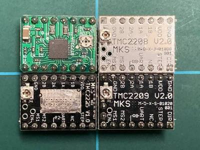

  * Other MotherBoards for Q5 and QQS:

    [NANOv1.2](./NANO)=>(**Q5_Header_robin_nano.bin**)

    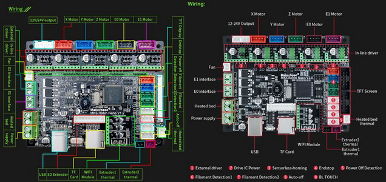
    
    [SKR](./SKR)=>(**Header-firmware.bin**)
    
    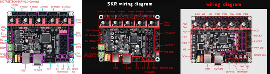 
    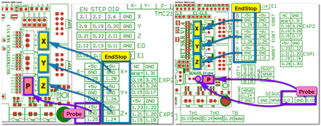

  Typically the probe for the QQS-Pro printers.
  
  * Z Probe Offset (-16.2mm)        * TFT screen color Marlin

    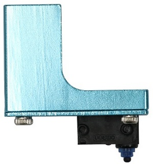        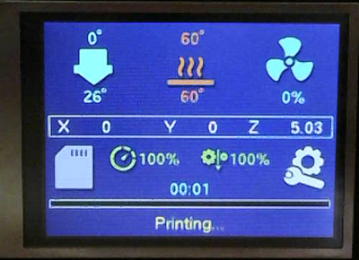
  

###  Optionals:

  * Modules Wifi
  
    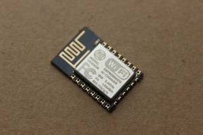
    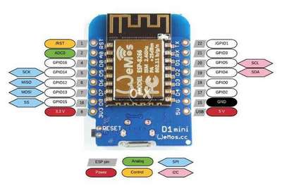

  * Led Strip with additional converter 24v/12-5v
  
    

  No validate:
  -TMC5121

## 1.4. CAPTION Firmwares

  **Exemple:** 
  8CWBL-Name_Of_Firmware.bin =>  (8)TMC2208 standalone - (C)UI Marlin - (W)Module Wifi - (B)Extruder BMG - (L)LinearAdvance  

  **Note**: After choosing your binary, remove the "8CWBL-" header or rename the file to "Robin_mini.bin" for QQS or "Robin_nano.bin" for Q5,
  place it on your SD card, insert your SD card into the printer and power on your printer.

  **Caption:**

  **/*------Drivers--------*/**
  - (S) A4988 (green/red)
  - (8) TMC2208 Standalone
  - (9) TMC2209 Standalone
  - (U8) TMC2208_UART with no module ESP12.
  - (U9) TMC2209_UART with no module ESP12.
  - (U8+) TMC2208 (XYZ) + Choice for E0 (A4988,TMC220x) 
  - (U9+) TMC2209 (XYZ) + Choice for E0 (A4988,TMC220x)
  - **(UH) TMC2209_UART with one wire (option modules Wifi/Rpi/Neopixel)**

  **/*-------Options UI TFT--------*/**
  - (F) UI STANDARD (Emulation LCD screen on TFT)
  - (C) UI MARLIN (TFT Color screen)
  - (r) UI STANDARD (Marlin Mode on TFT)

  **/*------Modules--------*/**
  - (N) NeoPixel (management of led strips)
  - (W) Module ESP8266/ESP12 (infos at the middle of the page)
  - (T) Extruder Titan
  - (B) Extruder BMG
  - (b) Extruder BMG mini
  
  **/*-------Others options in firmware----*/**
  - (A) BED_LEVELING_BILINEAR
  - (U) BED_LEVELING_UBL
  - (P) PreHeat bed before leveling
  - (R) ARC_SUPPORT
  - (L) Linear Advance (Possible Bug with BabyStep and TMC2208)
  
  **/*-------Others options for advanced users who build their firmware----*/**
  - HOST_ACTION_COMMANDS (Action Command Prompt support Message on OctoPrint) 
  - MEATPACK (Improve dialogue/communication with OctoPrint)
  - BINARY_FILE_TRANSFER
  - TEMP_SENSOR_0 (After changed the thermitor nozzle)
  - LCD_LANGUAGE (Change to the native language)
  - etc 
  
  **/*-------Others Firmwares for Q5 nanov1.2 or QQS with SKR family or Mks_Nano Family----*/**
  - (Q5_8+SCWTULR-Robin_nano35)   Q5 Stock(3xTMC2208+1xA4988). 
  - (Q5_9CWTULR-Robin_nano35)     Q5 with 4xTMC2209.
  - (QQS)U9rTULR16-SKR14_firmware QQS with SKRv1.4 Board with emulation LCD (Marlin Mode)
***
# 2. SETTINGS THE PRINTER 
  
  ### HELP - PROCEDURE - TIPS 
  After the flash, you must **RESET** your printer!!
  
  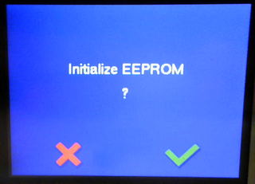
  
  By menu:
  - "Configuration/AdvancedSettings/InitializeEEPROM"
  
  By terminal:
  - with the command "M502" (Factory Reset), then "M501" (restore default) and "M500" (Save settings in EEPROM).
  
   # **VERY IMPORTANT:**
   First of all, you need to check that you have flashed the **correct firmware**.
   To do this, with a finger on the power switch :-), obtain a "HOME" from the menu (Motion/AutoHome) or a "G28" command from a terminal.

     Note for Q5: 
     After the flash, you may be asked to calibrate the screen: press the crosses on the screen to complete the calibration.
  
  Now YOU are ready to start a calibration of your printer!!
  
## 2.1. Delta Calibration
###  **Perform a Delta Calibration:**
  
  By menu: 
  - "Configuration/Delta_Calibration/AutoCalibration"(5/8 iterations).
  
  By terminal:
  - with the command "G33" or G33 V3 (5/8 iterations).
    
  **Tip** Via a terminal like Pronterface, Octoprint, Repetier, Astroprint, ESP3D, ...: 
        
        After a Delta calibration (G33 v3) if you get a "std dev:" sup.> 0.2, 
        it means that you have a problem with the structure of your printer!
        A "std dev:" of 0.04 and less is excellent !! standard is 0.08.
  
  After removing the probe, you need to redo/adjust the Z offset (Space between the nozzle and the bed=Real dimension of your probe).
  
## 2.2. Z_OffSet
###  **Perform a Z offset:**
  
  By menu: 
  - "Motion/MoveAxis" deactived the endstops.
  - "Motion/MovesAxis/Move ZThen lower the nozzle slowly to adjust to a sheet of paper.
  - View the value on the display and enter the value in the Configuration/ProbeZOffset" (Value between -17.00 and -13.00)
  - finally store the parameters "Configuration/StoreSettings".
  
  By terminal: 
  - deactivating the endstops with command M211 S0 =>read result in console.
  - View the value on the display and enter the value in the Probe_Z_Offset with command "M851 Z-xx.xx"
  - finally store the parameters with command "M500".
  - Control your result of operations by command "M503".
  
## 2.3. Bed Levelling
###  **Perform a bed calibration ([**UBL**](https://marlinfw.org/docs/features/unified_bed_leveling.html))**

  By terminal with the commands:
  - M190 S60 (temp bed at 60° or other)
  - G28 (autohome)
  - G29 P1 (automated probing of the bed)
  - G29 P3 T (Repeat until all mesh points are filled in)
  - G29 P3 T (bis)
  - G29 T (View the Z compensation values)
  - G29 S0 (Save UBL mesh points to EEPROM in the default location 0 )
  - G29 F10 (Set Fade Height for correction at 10 mm)
  - G29 A (Activate the UBL System)
  - M500 (Save to EEPROM)
  - M140 S0 (Stop temp bed)
  
  By menu:
  - Put your bed at working temperature.
  - Enter Motion/UnifiedBedLeveling/UBL Tools/Build Mesh/BuildColdMesh to run a levelling.

###  **Perform a bed calibration ([**ABL**](https://marlinfw.org/docs/features/auto_bed_leveling.html))**
  
  By terminal:
  - with the command "G29"

  By menu:
  - Put your bed at working temperature.
  - "Configuration/Levelling"

  **TIPS-LEVELLING**

    - You have 4 locations: so you can save (G29 Sx) different meshes at different bed temperature
     (ie: 1 for PLA, 2 for PETG, 3 for FLEX, etc. ) and call them back 
     when you slice from the PLA by command G29 L1 in the startGCode* of your filament.
     (*=PrusaSlicer).

    - If you later notice that the dimensions of your printed objects are inaccurate then 
    it will be necessary to carry out a final calibration of your turns by printing an object
    to correct these errors.

  ## 2.4. DIMENSIONS
  ### **Perform or correct by calculation (worksheet) the adjustment of your dimensions:**
  - To adjust the x, y, z precision, you first need a well-stabilized machine, 
  - ie being able to print on a well-leveled plate. Then by printing this model: [Advanced Delta Printer Calibration](https://www.thingiverse.com/thing:745523)
  - you adjust the DELTA_DIAGONAL_ROD (L) and the lengths DIAGONAL_ROD_TRIM_TOWER (ABC) between the laps by calculation (xls or [odt file](https://www.thingiverse.com/thing:1274733)) and you insert them all the parameters to be modified with this command [M665](https://marlinfw.org/docs/gcode/M665.html) Lxx Axx Bxx Cxx.

  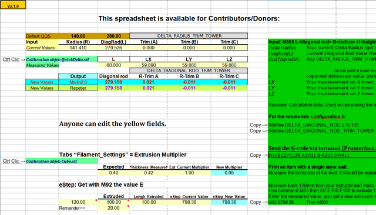

  - If you print the model again you should find a very small difference (0.1/0.09) on XYZ.
  - I prefer this model because it fits well with the caliper:[Objet_QuickCalDelta](https://www.thingiverse.com/thing:2256557)

  
  Remember to adjust your temperatures by doing your **Nozzle PID** and adjust your **eSteps** for stable filament flow.
  
  ## 2.5. PID
  [Proportional-Integral-Derivative](https://reprap.org/wiki/PID_Tuning)

  ### **Perform a nozzle PID:**
  
  By the menu: 
  - "Configuration/Advanced Settings/Temperature/PID Autotune E1" and choose your current working temperature (ie: PLA 210, PETG 230, ABS 250) 
  
  By terminal: 
  - with the command "M303 E0 **S210** C8 U0" (ie: S210 for PLA)
  
  ### **Perform a bed PID:**
  
  By menu: 
  - "Configuration/Advanced Settings/Temperature/PID Autotune Bed" and choose your current working temperature (ie: PLA 60, PETG 80, ABS 90)  
  
  By terminal: 
  - with the command "M303 E-1 **S60** C8 U" (ie: S60 for PLA)
  
  ## 2.6. EXTRUDER
  ### **Perform correct adjustment of the steps of your extruder.**

  ie: For the BMG, I set it to 415 but it's better to confirm it by command "M83" then "G1 E100 F100" which extrudes 100mm of filament.
  
  Preparation:
  - Remove your filament, the Capricorn/PTFE tube coming out of the extruder, introduce the filament into the extruder so that it comes out on the other side. 
  - Measure before extruding 120mm of filament to make a mark.
  
  By terminal:
  - Heat your nozzle to 190°C and run the previous command: "M83" then "G1 E100 F200" 
  - At the end, measure your remainder up to the mark and do rule of three:

        **LengthtoExtrude / LengthExtruded * Actuel_eStep (M92 E_old) = New_eStep (M92 E_new).**
  
  - Put a new value with command M92 Exxx and memorize M500 or "Store Settings"
  
  By menu (No possibility to adjust start and speed !!):
  - Heat your nozzle to 190°C and go to "Motion/MoveAxis/Extruder/Move 10mm"
  - .......

  ### **Perform correct filament flow.**
  - This chapter is being written ...............
***  
# 3. SPECIAL MODS
  - This chapter is being written ...............

## 3.1 TMC with UART mode
  - Wiring for UART mode.
    - Wire between Driver Stepper pins (UART/PDN) and pins Wifi socket (M1).
      Also remove only the M3 jumper under the stepper motors and set J11 (QQS) (near the XY stepper motor socket) to 3v3 as the input pins on the Wifi socket are only on 3v3 and all TMCs are 5v/3v3 compatible.
    
    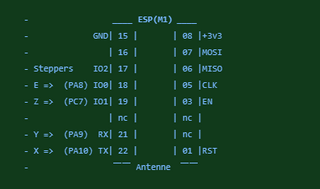  

    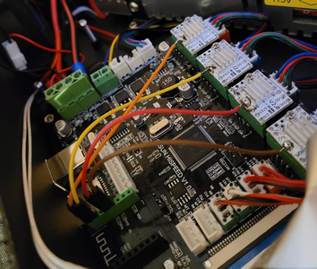 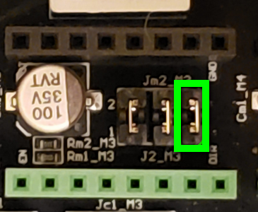
    
  - Control UART mode.
    - You can check their operation, use the M122 command through a terminal. 
    You will find out which one is malfunctioning or working well.
    
    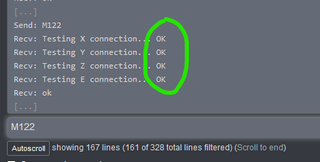

## 3.2 TMC2209 Single wire
  - Wiring for UART mode.
    Caution!! 
    - Power off 

    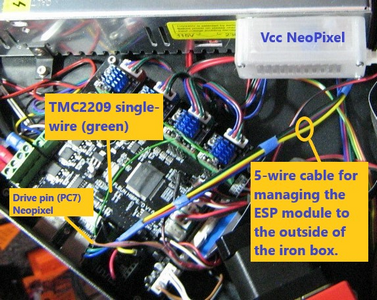
## 3.3 Raspberry
  - Improve your Raspberry (Bauds, plugins, Network).
  
    
## 3.4. Various assembly
### Wiring for mounting Esp8266, filament detector, temperature probes, relay control, etc.
  
  1. Module Wifi (ESP or MKS_Wifi):
      - Use a cable.....
  
      
  2. Module filament Sensor:
      - Use the socket MT_DET on your board with a cable (3 wires).
      - Wires are: Signal (White), Ground (Black), Power (Red) 
  
      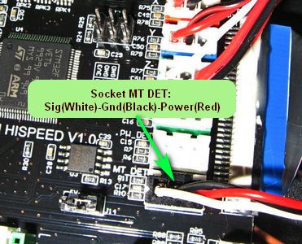
  
  3. Module Relay(s)
      - Put a platine.....
  
      
  4. Module convertor, probe, ......
      - You can insert.....
  
      
      
## 3.5. Mechanical & electronic precautions
###  - Mechanical check.

  To avoid destroying your belts after two weeks of use, inspect the bottom of your printer while removing the protective plate:
  If you find white blocks stuck with glue on your stepper motor, remove them because they are only used to hold your belts during transport and the first assembly of your printer. 
    
  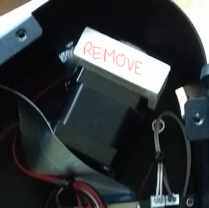

  The problem with these blocks is that they come loose over time or with vibration. By detaching, they can position themselves askew and force on the pulleys of the belt.
  They can also jam your belts and overheat the stepper motor and even burn the stepper driver.
  Another problem arises when you try to over-tension the belts:
  The stepper motor support gradually twists and the stepper motor/pulley axis is no longer perpendicular to the axis of the belts. This causes wear of the belts and friction noises on the passage of the belts !! 
    
  Some [videos](https://www.facebook.com/groups/120961628750040/permalink/664723794373818/) on the problems generated by this.      
  To remedy all this, just print one of the models on thingiverse (links: thing:4587495, thing:4376799, thing:4586703)

  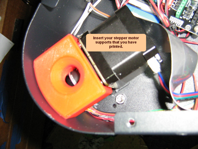

  Do not forget to check that your pulleys are tight and centered on the axis of the belt with the appropriate screws or that they are well stamped on the axis of the motors !
    
  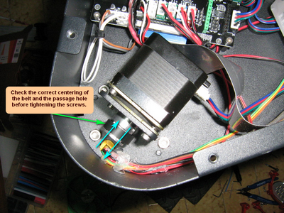 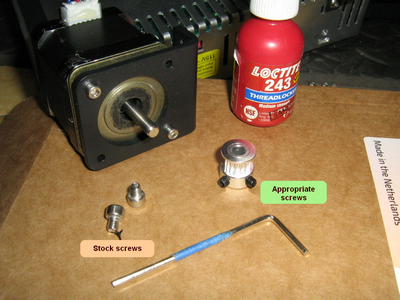 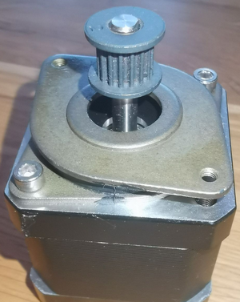.

###    **Once you've got all of that sorted out, you'll be comfortable with your belts' even tension and longevity.**

   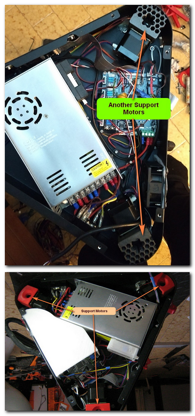

###  - Electronic check.

  - Check your power supply with a controler....
    
    When my printer arrived but you can still do it afterwards, I switched on and controlled the power output using a multimeter (channel higher than 30V DC). I noticed that the multimeter was measuring 23.6v DC output!! This is not enough to power all the electronics. 
    
  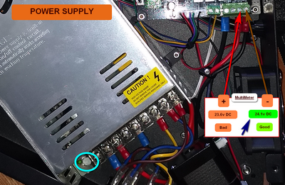

  You can adjust this voltage to 24.1V DC by manipulating with an insulated or ceramic screwdriver, the small potientionmeter which is just next to the power supply outputs (Blue Circle on the picture). 
    
  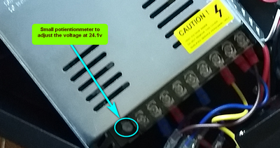

  - Check the Vref voltage of your stepper motor drivers with a controler.....
  
  **WHY?**
    
  Underpowered, it will lose its torque and may even vibrate without being able to keep its stable position.
  Supercharged, it will make a lot of noise by resonance and of course will overheat (the stepper motor driver also reacts).

  For the A4988s, the Vref should be between 0.65 and 0.79v.
  For TMC220xs, Vref should be between 0.8 and 1v.
  Mine are 900mv for the XYZ axes and 850mv for the extruder(E).

  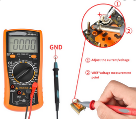
  
  These Vref values depend on the properties of your stepper motors and are obtained by calculation. If you change your stepper motors, you must readjust these Vrefs!
  
  [**Formulas:**](https://v6zmvq5nk5.codesandbox.io)
   
   **A4988**=>VREF = Rated motor current x 8 x Rsense x 0.9 (10% safety margin)
   
   **TMC220x**=>VREF = Rated motor current x 0.8 (20% safety margin)
***
# 4. SLICER PART
### **TIPS-SLICER** 
  
  In your **Start_GCode** on your Slicer.
  - M420 S1 enable bed leveling but in my firmware G28 activate the last mesh used or the default one (0)
  - M420 Lx or G29 Lx (Load mesh_x correction). 
    If you are using PrusaSlicer you can add a line "*G29 Lx; load mesh PLA*" in the **Filament** starting GCode instead of the G29 Lx in the printer start GCode.

  And on my **EndGCode** I remove G28 and I substitute with this type of code:

        {if layer_z <max_print_height} G1 Z {min (layer_z + 100, max_print_height)} {endif} F4000

  This works fine in [PrusaSlicer](https://help.prusa3d.com/en/article/macros_1775) and goes 100cm above the finished object. It's up to you to adapt it for your favorite Slicer or to improve mine.

  ### **You will find some Slicer profiles in the "Slicers" [directory](../Slicers).** 

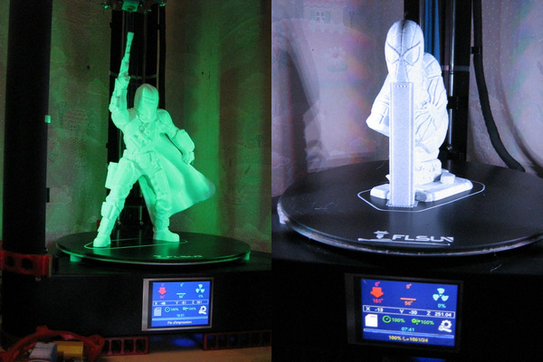
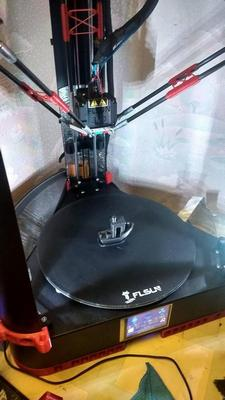

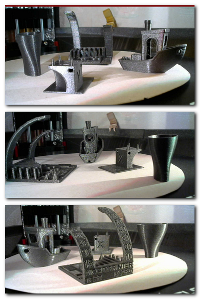
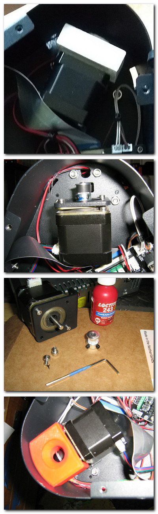
***
# 5. Firmware Wifi

For the firmware Wifi Module, go to ESP3DV2 [directory](./ESP3D):

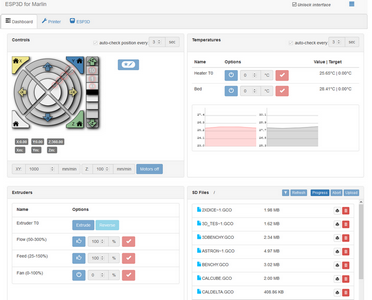

Enjoy and support my work ....🙃

 
 ## Support my work

  This QQS-Pro porting project for the Marlin firmware was only possible thanks to its supporters, you can participate via
   
   
   
   
   
   

  You can also send me a tip via [Thingiverse](https://www.thingiverse.com/FamStel/about) if you prefer.

 Massive thank you in advance :heart:
***
# 6. Version history
  ## Marlin 2.0 Bugfix Branch
  Update Marlin-BugFix 20210129
  - Last fix by Marlin,
  - New QQS_Config rename FLSUNQ_Config (QQSP & Q5)
  - Support QQSP/Q5 Stock, TMC and UART mode.
  - **All QQSP features on Q5.**
  - Choice UI Classic (Lcd) and Color (TFT)
  - Change BAUDSRATE at 250000
  - Update ReadMe.

  ## Marlin 2.0 Bugfix Branch
  Update Marlin-BugFix 20210117
  - Last fix by Marlin,
  - Fix PID Range to 30,
  - add Preheat before leveling.
  - New core for SKR14 and SKR14T (Ready TFT host)

  ## Marlin 2.0 Bugfix Branch
  Update Marlin-BugFix 20210109
  - Last fix by Marlin,
  - Fix Feedback Users,
  - Reduction of the hysteresis range from 10 to 6,
  - 4 Mesh Locations,
  - Functions disable but enable by menu (Runout, PowerLoss),
  - **New_Core** size reduction (Small Boot Logo) and build optimization,
  - Fix PowerLoss,
  - Fix SDCard corrupted,
  - Fix for "Mesh Edit",
  - New test firmwares for Q5 (Stock and TMC2209).
  - Special firmware for supporters and developments (Christmas Gift).

  ## Marlin 2.0 Bugfix Branch
  Update Marlin-BugFix 20201223
  - News directory by Boards (HISPEED, NANO, SKR)
  - Last fix by Marlin,
  - Fix Feedback Users(Fan, CalDelta, Accel,...)
  - **FIX New_Core** size reduction and build optimization,
  - Some optimisation moves/accel printing, Calibration UBL, Standard Home, etc**
  - No fix for "Mesh Edit".

  ## Marlin 2.0 Bugfix Branch
  Update Marlin-BugFix 20201213 
  - Last fix by Marlin,
  - **New_Core** size reduction and build optimization,
  - Some optimisation moves/accel printing, Calibration UBL, Standard Home, etc**
  - No fix for "Mesh Edit".
  - Validate Connecttion Rpi/OctoPi direct (No_USB).

  Update Marlin-BugFix 20201120
  - Last fix by feedback users.
  - **News Firmwares with optimisation moves/accel printing, Calibration UBL, Standard Home, etc**
  - Validate TMC2209 modes.
  - Validate Module Wifi ESP8266/ESP12 [Firmware ESP3Dv2](https://github.com/luc-github/ESP3D/wiki/Install-Instructions)

  Update Marlin-BugFix 20201030
  - Last correction for Black screen in UI Color
  - Correction thermal protection hysterisis.
  - Enable mode TMC220x UART SoftSerial
  - Add comments into definition_pins file.

  Update Marlin-BugFix 20201022
  - Integration in the Marlin firmware of the HISPEED motherboard and configuration files for the QQS-Pro.
  - Fixed Deploy/Stow ZProbe
  - Fixed for users using E3Dv6 hotend
  - Others TIPS(QQS_Config.h, Quick calibration 6, Menu management of NeoPixel leds, etc).

  ## Marlin 2.0.7 
  Update 2020-10-01
  
  ## Marlin 2.0 Bugfix Branch
  Update Marlin-BugFix 20200905

