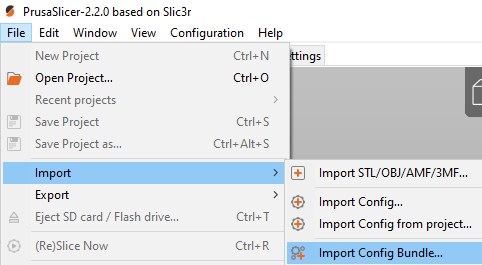

# 1. Slicers configuration files

You will find here 2 types of configuration files, Cura and Prusa Slic3r configuration files

- [1. Slicers configuration files](#1-slicers-configuration-files)
  - [1.1. File naming convention](#11-file-naming-convention)
  - [1.2. How to import Prusa Slic3r config bundle](#12-how-to-import-prusa-slic3r-config-bundle)
  - [1.3. How to import Cura configuration](#13-how-to-import-cura-configuration)

## 1.1. File naming convention

We are applying this naming convention on configuration files:  
[slicer]-[Release]-[Text]-[Version].[Extension]  
Example: *PrusaSlicer-2.2.0-config_bundle_FLSUN_QQS-v1.ini*

## 1.2. How to import Prusa Slic3r config bundle

Download the right config bundle file (take care about the version of the file for the right release of Prusa Slic3r)  
Start Prusa Slic3r  
Select File -> Import -> Import Config Bundle... for a pack of Presets/Filaments/Printers

and -> Import Config... for a single pack Preset/Filament/Printer. 

  

[F.A.Q](https://help.prusa3d.com/en/article/faq-prusaslicer_1789)

## 1.3. How to import Cura configuration

To Do  
