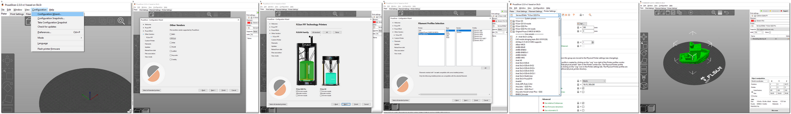

[PrusaSlicer Releases](https://github.com/prusa3d/PrusaSlicer/releases)

# Introduction

**You now have the option of integrating profiles for the two main Delta printers: the QQS and the Q5.** 

To do this you need to download the pack **"Date-PS_FLSun_profiles.zip"** then you just have to unzip it in the "resources/profiles" directory of your PrusaSlicer installation folder. 

Once done, launch prusa-slicer.exe and the user interface appears, you can launch the wizard to add the profiles of the printer of your choice.

**Note:** This pack will be integrated in the next version of PrusaSlicer 2.3 and above.

# 1. Slicers configuration files

You will find here 2 types of configuration files, Cura and Prusa Slic3r configuration files

- [1. Slicers configuration files](#1-slicers-configuration-files)
  - [1.1. File naming convention](#11-file-naming-convention)
  - [1.2. How to import Prusa Slic3r config bundle](#12-how-to-import-prusa-slic3r-config-bundle)
  - [1.3. How to import Cura configuration](#13-how-to-import-cura-configuration)

## 1.1. File naming convention

We are applying this naming convention on configuration files:  
[slicer]-[Release]-[Text]-[Version].[Extension]  
Example: *PrusaSlicer-2.2.0-config_bundle_FLSUN_QQS-v1.ini*

## 1.2. How to import Prusa Slic3r config bundle

Download the right config bundle file (**Take care about the version of the file for the right release of Prusa Slic3r**)  
Start Prusa Slic3r  
Select File -> Import -> Import Config **Bundle** ... for a pack of **Presets/Filaments/Printers**

and -> Import Config... for a **single** pack Preset/Filament/Printer. 

  

[F.A.Q](https://help.prusa3d.com/en/article/faq-prusaslicer_1789)

## 1.3. How to import Cura configuration

To Do  ..............

Enjoy....🙃

 ## Support my work

 This FLSun printer profile adjustment project for the PrusaSlicer slicer was only possible thanks to its supporters, testers (DavidT, Andy, ChrZ, JoeB, ....). So thank you to them.
 Otherwise a little coffee or a thermos to help me support other developers !! via
 
   
   
   

 Massive thank you in advance :heart:

