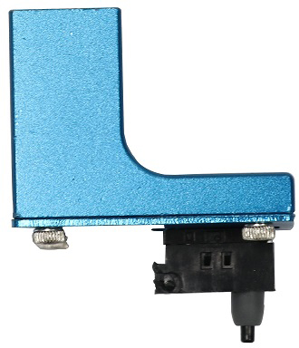

# Readme

These configurations activate many of the new advanced features of the Marlin firmware:

 * Auto Calibration
 * Auto Bed Leveling
 * Pause & Filament Change

**Important**: Before doing anything else after updating the firmware, go to `Configuration > Advanced Settings > Initialize EEPROM` to get rid of old configurations.

Then you should execute `Configuration > Delta Calibration > Set Delta Height` and also run `Configuration > Delta Configuration > Probe Z-offset` to verify the Probe offset.

After that you should connect the Z-Probe and start `Configuration > Delta Calibration > Auto Calibration`. When it's done don't forget to also do `Configuration > Delta Calibration > Store Settings` to make it permanent.

You should also do a `Motion > Bed Leveling > Level bed` followed by `Store Settings` to ensure a perfect leveling.

Please do a manual paper test (moving the nozzle slowly down to Z0 and checking with a piece of paper). If it's not perfect, use `Configuration > Advanced Settings > Probe Z Offset` to correct the difference and execute the calibration again.

# Select the Configuration

**Please select the correct values at the start of the Configuration.h file**

The Kossel comes in 3 versions:

 * Pulley
 * Linear
 * Linear Plus

Pulley and Linear use the same configuration, the Linear Plus is bigger and uses slightly different configurations.

Typically the probes for the Anycubic Delta Kossel printers come in two different versions.

  * Version 1: Z Probe Offset of -19.0mm

    

  * Version 2: Z Probe Offset of -16.8mm

    

If you select the `ANYCUBIC_PROBE_VERSION 0`: It's very important to follow the correct procedure to set it up after flashing the firmware, otherwise you might damage the printer by ramming the nozzle into the buildplate:

* `Configuration > Advanced Settings > Initialize EEPROM`
* `Motion > Move Axis > Soft Endstops` : `Off`
* Auto Home and slowly move the nozzle down until it barely touches the bed. (Do a paper-test: A normal sheet of paper should just feel the drag of the nozzle) and note this number.
* Subtract this number from the value in `Configuration > Delta Calibration > Delta Settings > Height`. (If it's negative, add it).
* Save and try the paper test again to verify your height.
* `Configuration > Store Settings`
* Motion > Bed Leveling (using paper test)
