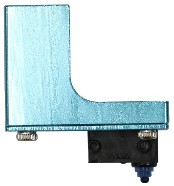

# Readme

These configurations activate many of the new advanced features of the Marlin firmware:

 * Auto Calibration
 * Auto Bed Leveling
 * Pause & Filament Change

**Important**: Before doing anything else after updating the firmware, go to
`Configuration > Advanced Settings > Initialize EEPROM` to get rid of old configurations

After that you should connect the Z-Probe and start `Configuration > Delta Calibration > Auto Calibration`. When it's done don't forget to also do `Configuration > Delta Calibration > Store Settings` to make it permanent.

You should also do a `Motion > Bed Leveling > Level bed` followed by `Store Settings` to ensure a perfect leveling.

Please do a manual paper test (moving the nozzle slowly down to Z0 and checking with a piece of paper) - if it's not perfect, use `Configuration > Advanced Settings > Probe Z Offset` to correct the difference and execute the calibration again.

**Also Important**: if you value your Z-Probe do NOT execute `Configuration > Delta Configuration > Probe Z-offset` - this can destroy the Z-Probe, see issue [#11337](https://github.com/MarlinFirmware/Marlin/issues/11337)

# Selection of firmware version

Please select the correct subdirectory for your printer.

The Anycubic Kossel comes in 3 versions:

 * Pulley
 * Linear
 * Linear Plus

 Pulley and Linear use the same configuration, the Linear Plus is bigger and uses slightly different configurations.

Typically the probes for the Anycubic Delta Kossel printers come in two different versions. Specify your probe version at the top of the `Configuration.h` file for your machine.

  * Version 1: Z Probe Offset of -19.0mm

  	

  * Version 2: Z Probe Offset of -16.8mm

  	
