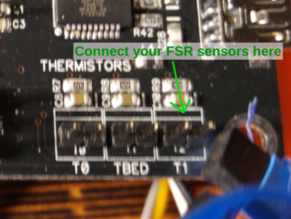

#Deltaprintr 3D Printer Firmware
--------------------------------

Based on [Marlin](https://github.com/MarlinFirmware/Marlin), see [README_Marlin.md](README_Marlin.md).

This repository's [RC_Deltaprintr branch](https://github.com/tkurbad/Marlin/tree/RC_Deltaprintr)
combines the most recent release of [Marlin](https://github.com/MarlinFirmware/Marlin)
with the FSR bed leveling code necessary for a standard [Deltaprintr](http://www.deltaprintr.com)
setup.

The new firmware

* incorporates all the fixes and enhancements of the most recent Marlin release,
* includes the [LCD speedup](https://github.com/AnHardt/Marlin/tree/lcd-speedup)
patches by AnHardt, which greatly enhance the printer's overall performance and eliminate
stuttering and blobbing at high printing speeds (beyond 80 mm/s)
* allows the Deltaprintr to be equipped with a [heated bed](http://www.tk-webart.de/wiki/doku.php?id=wiki:deltaprintr:deltaprintr_modifications)
* allows for several other modifications, like utilizing [JohnSL's FSR board](https://github.com/JohnSL/FSR_Endstop)
for bed leveling

**Important notes**

_Do **not** simply use `Marlin/Configuration.h` with your printer._
_Instead, have a look at the supplied [instructions](https://github.com/tkurbad/Marlin/tree/RC_Deltaprintr/Marlin/example_configurations/delta/deltaprintr_ks_rg)_
_to find the configuration that best matches your printer's setup._

_Should you have **modified** your Deltaprintr, e.g. installed a different_
_hotend, print platform, etc., please **double check** the values in_
_the `Configuration.h` and `Configuration_adv.h` files to match your printer's_
_hardware setup_

_For **all** supplied configuration files that are **not explicitely labeled**_
_as being for_
_[JohnSL's FSR sensor board](https://github.com/JohnSL/FSR_Endstop),_
_**make sure** to connect the_
_FSR sensors to the **T1** input, **not** to **TBED** as in the default_
_Deltaprintr setup!_



**DISCLAIMER**

Use this fork of Marlin at your own risk. I take **no responsibility**
whatsoever for any defect of the software and the results thereof.
Furthermore, I'm not affiliated with [Deltaprintr](http://www.deltaprintr.com)
and this firmware is not officially tested, distributed, or supported by
the Deltaprintr stuff.

If you understand and agree to this terms, read on.

##Build/Install instructions

###Generic

* **First of all, turn over your Deltaprintr and move the two-pin FSR connector from `TBED` to `T1`!**
* Download and install the most recent (1.6.8) version of the Arduino IDE+
from https://www.arduino.cc/en/Main/Software
* Clone this repository `git clone git@github.com:tkurbad/Marlin.git`
* Change to the `Marlin` directory you just cloned into
* Make sure to checkout the correct branch `git checkout RC_Deltaprintr`
* According to the setup/modifications of your printer, choose the appropriate
`Configuration.h` and `Configuration_adv.h` files from the subdirectory
`Marlin/example_configurations/delta/deltaprintr_ks_rg` and copy them to the
root of the `Marlin` subdirectory, i.e. the directory, where the file `Marlin_main.cpp` resides.
Consult the [README](Marlin/example_configurations/delta/deltaprintr_ks_rg/README.md)
to find out which example configuration might be the correct one for you
* **Carefully** revise the configuration files you copied in the last step
* Connect your Deltaprintr via USB
* On a Windows PC, you will most probably have to install the Arduino serial port
drivers upon first connecting your printer
* Once all drivers are installed, start the Arduino IDE and open the file
`Marlin.ino` from the `Marlin` subdirectory
* From the *Tools* menu choose *Board* &rarr; *Arduino/Genuino Mega or Mega 2560*
* In the same menu, choose the correct serial *Port* (`/dev/ttyUSB*` on Linux, `COM*` on Windows)
* From the *Sketch* menu, choose *Include library* &rarr; *Manage libraries*,
then click on *Time* &rarr; *Install* and *U8glib* &rarr; *Install*
* From the *Sketch* menu, choose *Verify/Compile*
  The last two lines of the output should look similar to:
```
Sketch uses 133.698 Bytes (52%) of program storage space. Maximum is 253,952 bytes.
Global variables use 5.510 Bytes (67%) of dynamic memory, leaving 2.682 bytes for local variables. Maximum is 8,192 bytes.
```
* If everything worked thus far, you can choose *Upload* from the *Sketch* menu to upload the firmware to your printer

###Gentoo Linux

Gentoo Linux has a pecularity with the `avrdude` binary that prevents the original
one shipped with the Arduino IDE from working properly.

Therefore, you have to follow these additional steps:

* Before unpacking the Arduino IDE, as user `root` install `dev-embedded/avrdude`:
```
mkdir -p /etc/portage/package.use
echo "dev-embedded/avrdude ftdi" >> /etc/portage/package.use/avrdude
emerge -NDuv dev-embedded/avrdude
```
* Then, after unpacking the Arduino IDE, e.g. to the directory `~/projects/deltaprintr/arduino-1.6.8`,
create a symlink to the `avrdude` you installed before:
```
ln -sf /usr/bin/avrdude ~/projects/deltaprintr/arduino-1.6.8/hardware/tools/avr/bin/avrdude
rm -f ~/projects/deltaprintr/arduino-1.6.8/hardware/tools/avr/bin/avrdude_bin
```

All the other steps remain the same.

##Testing

After uploading the firmware to the Deltaprintr, you should do a few simple tests
to ensure some basic functions. Be prepared to **pull the plug** at any time, should something
unexpected happen.

* From the *Main LCD menu* of your Deltaprintr, choose *Prepare* &rarr; *Autohome*.
The printer should home as usual, hitting the endstop switches on top of the three towers.
However, the "going up and down a bit several times" it did after homing with
its original firmware should no longer occur.
* Now, from the *Prepare* menu, choose *Level bed*. The printer will now do the
short down and upwards moves against the endstop switches it used to during homing with the
original firmware. This procedure, btw., calibrates the FSR sensors for the printer's
inherent vibrations. Afterwards, the printer should do the bed leveling as per G-code `G29`.
If it tries to dig into the bed while doing so, pull the plug and double check that you
**moved the FSR connector to T1**.
* If everything worked fine, do a small test print as you would have with the
original firmware.
* If the print test succeeded, it should be safe to assume that the printer works
properly.

Have fun with your improved Deltaprintr!

##Further reading / Link collection

* [PID autotuning guide for bed and hotends](http://reprap.org/wiki/PID_Tuning)
* [Azteeg X3 specifications](http://reprap.org/wiki/Azteeg_X3)
* [Dokumentation of my Deltaprintr modifications](http://www.tk-webart.de/wiki/doku.php?id=wiki:deltaprintr:deltaprintr_modifications)
