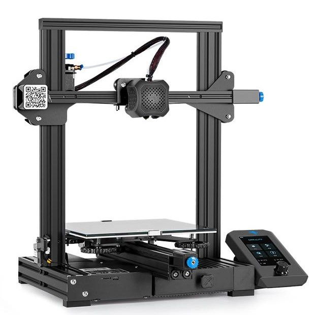
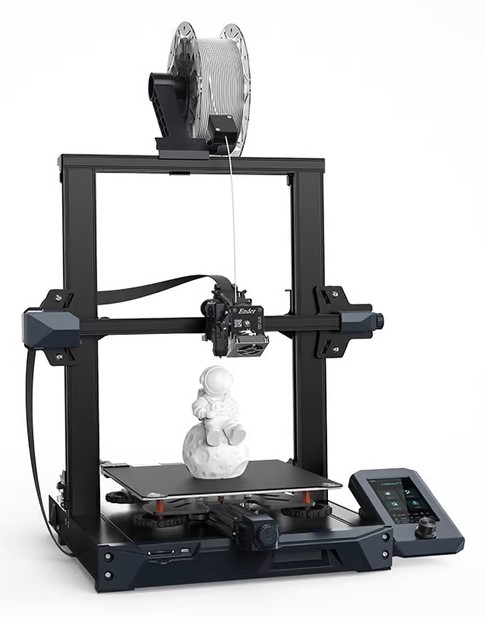

# Professional Firmware for the Voxelab Aquila and Creality Ender 3 Printers
\

## Universal RET6/RCT6 chips: G32, N32, (working on H32), Creality 4.2.7 and 4.2.2 boards

I will be working on more upgrades and features and tweaks along the way. Enjoy using this fork of Marlin as I intend it to be the best. It is easy to use and convenient. So far I really enjoy the new settings and toolbar for the main menu. There is a variety of parameters and options that can be changed without having to reflash the firmware. 

[Linear Advance Information](https://github.com/MarlinFirmware/MarlinDocumentation/blob/master/_features/lin_advance.md)

The Precompiled binary files of this firmware can work with STM32 (STM32F103RET6/RCT6) and it's clones G32 (GD32F103RET6), N32 (Nation), and possibly H32. They can be downloaded from:
[Latest Release](https://github.com/classicrocker883/MriscocProUI/releases/latest)

 

 

## Donations
Please consider making a donation, as large or as small and as often as you'd like.
Thank you for your support, I receive donations through [Paypal](https://www.paypal.com/paypalme/andrewleduc)   

   

## Wiki
 - [How to install the firmware](https://github.com/mriscoc/Ender3V2S1/wiki/How-to-install-the-firmware)
 - [Installing a 3D/BLTouch](https://github.com/mriscoc/Ender3V2S1/wiki/3D-BLTouch)
 - [Color themes](https://github.com/mriscoc/Ender3V2S1/wiki/Color-Themes)
 - [How to use with Octoprint](https://github.com/mriscoc/Ender3V2S1/wiki/Octoprint)
  
## Community links
* [Telegram](https://t.me/ender3v2s1firmware)
* [Aquila Reddit](https://www.reddit.com/r/VoxelabAquila) 
* [E3V2 Reddit](https://www.reddit.com/r/Ender3v2Firmware) 
* [E3V2 Facebook](https://www.facebook.com/groups/ender3v2firmware)
* [E3S1 Facebook](https://www.facebook.com/groups/ender3s1printer)

<!---->

## Credits

This fork of Mriscoc's ProUI firmware is maintained by [@classicrocker883](https://github.com/classicrocker883) (yours truly)

ProUI is a Marlin based firmware maintained by [@mriscoc](https://github.com/mriscoc)

Marlin is maintained mainly by [@thinkyhead](https://github.com/thinkyhead) 

This work would not be possible without me spending time working on it for free.

I would greatly appreate supporters, helpers and betatesters whenever possible.

Please consider making a donation or show your support or input if you end up using this firmware.

It wasn't easy getting it to this point. I am just a basic programmer and the work is mostly trial and error. Thank goodness for VS Code's compiler which shows me what changes need to be made as I make them.

Marlin firmware is an Open Source project hosted on Github, [Marlin](https://marlinfw.org/) is owned and maintained by the maker community.  

VS Code is an IDE program owned and maintained by Microsoft.

## Disclaimer  

THIS FIRMWARE AND ALL OTHER FILES IN THE DOWNLOAD ARE PROVIDED FREE OF CHARGE WITH NO WARRANTY OR GUARANTEE. SUPPORT IS NOT INCLUDED JUST BECAUSE YOU DOWNLOADED THE FIRMWARE. WE ARE NOT LIABLE FOR ANY DAMAGE TO YOUR PRINTER, PERSON, OR ANY OTHER PROPERTY DUE TO USE OF THIS FIRMWARE. IF YOU DO NOT AGREE TO THESE TERMS THEN DO NOT USE THE FIRMWARE.

## LICENSE
For the license, check the header of each file, if the license is not specified there, the project license will be used. Marlin is licensed under the GPL.
