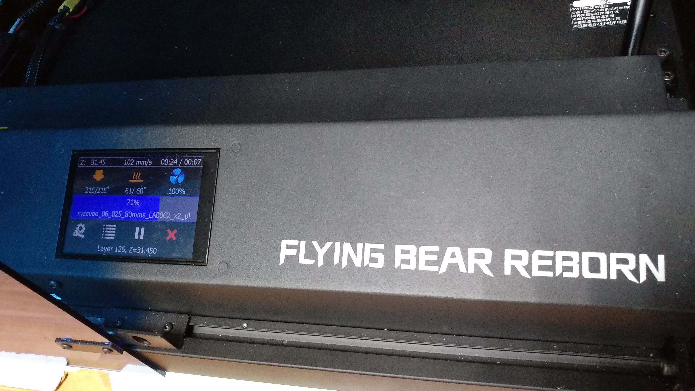
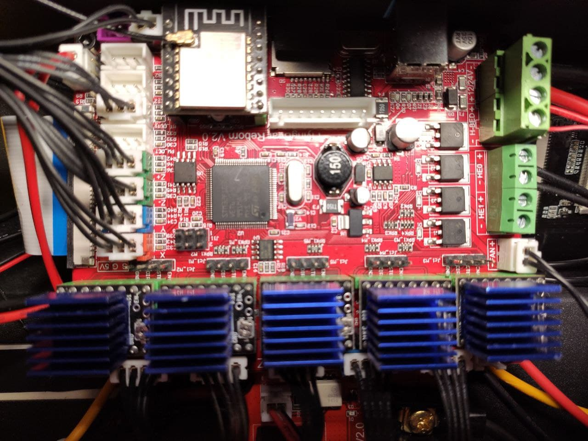
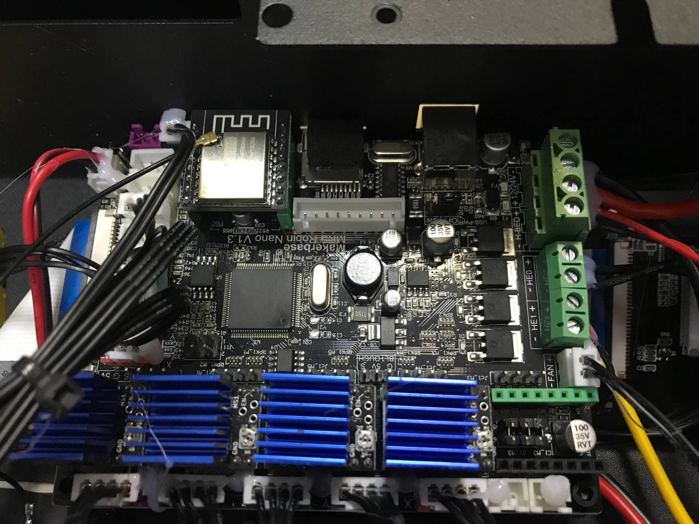
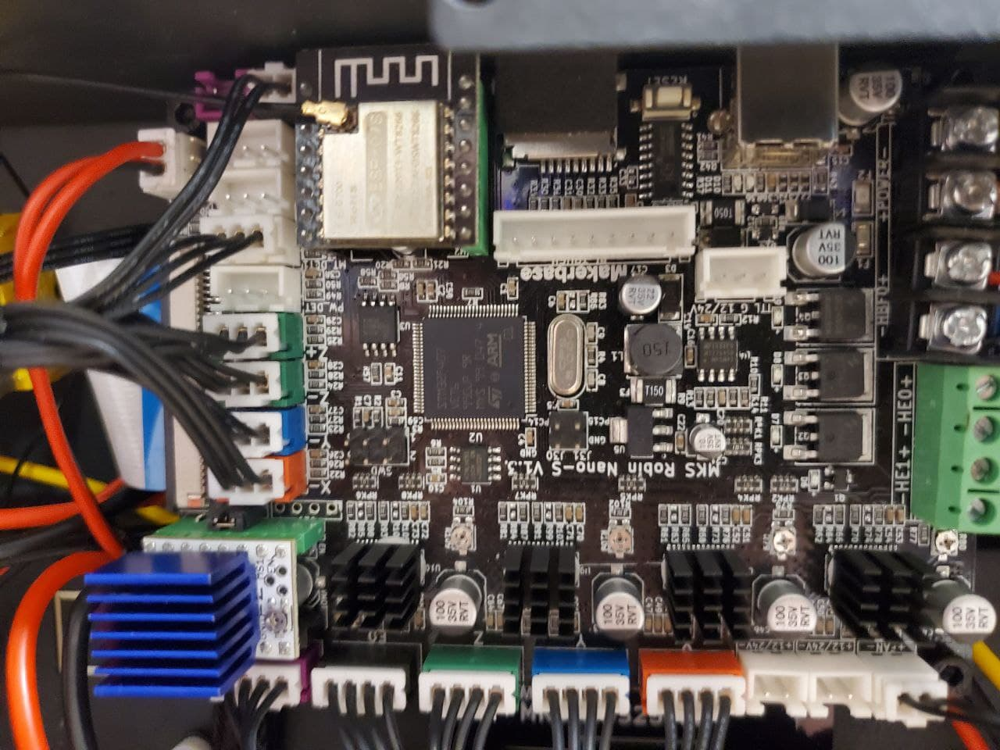
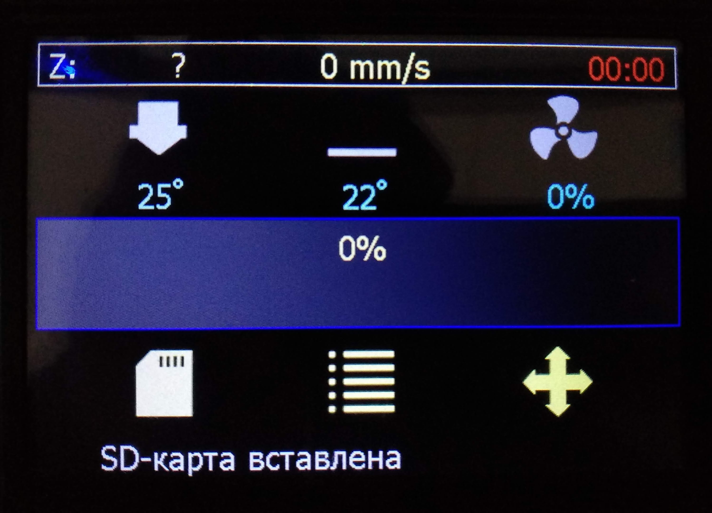
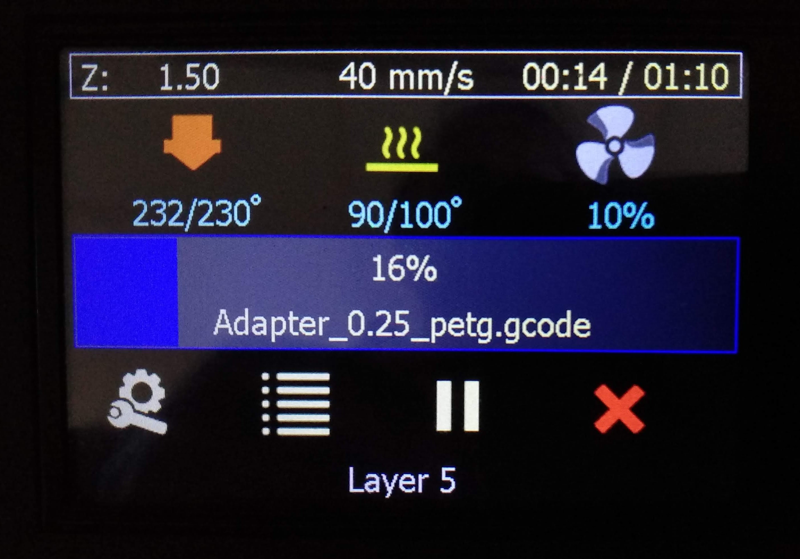
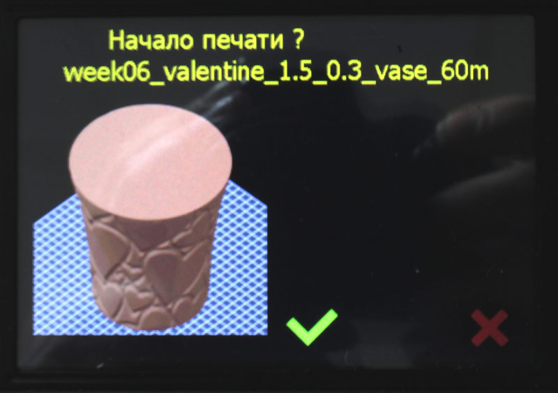
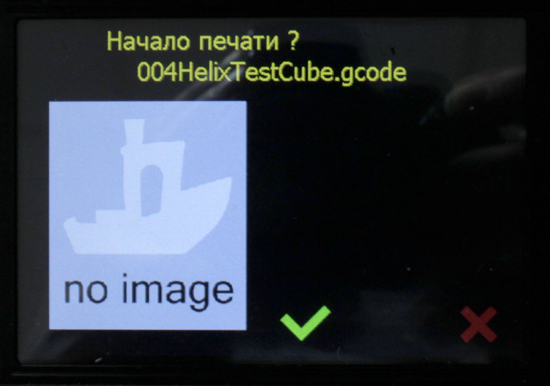

[English](#english-version)

  

# Прошивка MarlinRB для принтера Flyingbear Reborn

### Собранные готовые файлы прошивки находятся в [разделе Releases](https://github.com/Andy-Big/Marlin_FB_Reborn/releases)

Работает с платами: **MKS Robin Nano v1.3** (съемные драйвера, контроллер STM32F407), **MKS Robin Nano S v1.3** (несъемные драйвера, контроллер STM32F407) и **MKS Robin Nano v1.1** (красная плата со съемными драйверами, контроллер STM32F103, может иметь название Flyingbear Reborn v2.0). Для всех трех плат прошивка построена в двух вариантах - для драйверов с микрошагом 16 и для драйверов с микрошагом 32.

Основана на [Marlin 3D Printer Firmware](https://github.com/MarlinFirmware/Marlin)  версии 2.0.9.2

## Содержание
* [Главное](#главное)
* [Соответствие вариантов прошивки разным платам](#соответствие-вариантов-прошивки-разным-платам)
* [Новый главный экран интерфейса](#новый-главный-экран-интерфейса)
* [Отображение предпросмотра](#отображение-предпросмотра)
* [Установка](#установка)
* [Настройка WiFi](#настройка-WiFi)
* [История](#история)

## Главное
Обновлено 29.01.2022
- WiFi интерфейс для управления принтером и передачи файлов
- активирован Linear Advance
- активирована возможность использовать встроенные в прошивку ретракты (командами G10, G11)
- отображение картинки предпросмотра при выборе файла (поддерживается предпросмотр PrusaSlicer и только на платах Robin Nano v1.3 и Robin Nano S v1.3)
- активен датчик окончания филамента
- предусмотрено подключение модуля управления питанием (PSU) MKS PWC
- добавлена настройка автоматического отключения питания по окончанию текущей печати (при подключенном модуле управления питанием)
- добавлена настройка направления вращения моторов X/Y/Z/Z2/E
- включена калибровка стола ("Выровнять стол" с ручной подгонкой высоты сопла по 9 точкам)
- включена подстройка винтами стола по 4 точкам, соответствующим положению регулировочных винтов ("Выровнять углы")
- исправлены все косяки вывода русскоязычных надписей
- поддержка русских имен файлов
- по умолчанию стоит ограничение на ускорения осей - 3000 мм/сек\*сек, скорость - 250 мм/сек
- интерфейс - стандартный графический с измененным главным экраном
- выбор языка интерфейса - английский или русский
- хранение настроек (EEPROM) во внешней SPI-флэш W25Q64

## Соответствие вариантов прошивки разным платам
Прошивка собрана в нескольких вариантах, каждый из которых подходит к определенной плате, которая встречается в принтере Reborn.
1. **v_Robin_Nano_1.1_x16** - предназначена для плат MKS Robin Nano v1.1, известной так же как Flyingbear Reborn v2.0 в стоковой конфигурации.

2. **v_Robin_Nano_1.3_x32** - предназначена для плат MKS Robin Nano v1.3 со съемными драйверами в стоковой конфигурации.

3. **v_Robin_Nano_S_1.3_x16** - предназначена для плат MKS Robin Nano S v1.3 с четырьмя впаянными и одним съемным драйверами в стоковой конфигурации.
Вариант **v_Robin_Nano_SM_1.3_x16** подходит для этих же плат если пользователем были переставлены разъемы E0 и E1, то есть мотор экструдера был подключен к съемному драйверу

## Новый главный экран интерфейса
Главный экран был полностью переработан для обоих режимов - в простое и при печати.

### Новый главный экран в режиме простоя

Убран блок с координатами осей, его место в центре экрана теперь занимает полоса прогресса печати. Координаты осей X и Y в подавляющем большинстве случаев не нужны пользователю на главном экране, поэтому они полностью удалены. Координата оси Z перенесена в верхнюю строку состояния.
Вверху экрана добавлена строка состояния, в которой отображаются координата оси Z, текущая скорость движения сопла и время печати. В режиме простоя время печати будет показывать время последней завершенной печати или нули если после включения принтера печать не производилась.
Показания значений температуры сопла и стола, а так же вращения кулера указываются одной строчкой под соответствующей иконкой. Изменение цвета иконки происходит следующим образом:
- для сопла: **серая** - пока температура меньше минимальной температуры экструзии (экструдер не будет работать при такой температуре); **желтая** - если температура выше минимальной температуры экструзии, но меньше заданной; **красная** - температура равна заданной плюс-минус 3 градуса (параметр TEMP_HYSTERESIS в файле Configuration.h)
- для сопла: **серая** - пока температура меньше 40°C; **желтая** - если температура выше 40°C, но меньше заданной; **красная** - температура равна заданной плюс-минус 3 градуса (параметр TEMP_HYSTERESIS в файле Configuration.h)
- для кулера: **серая** - пока вращение меньше 10%; **синяя** - если вращение больше или равно 10%
Как и в старом интерфейсе, нажатие на иконку сопла, стола или кулера вызовет переход на изменение соответствующего показателя.
Самой заметной частью экрана является показатель прогресса печати в средней части экрана. Он сделан в виде очень толстой полосы прогресса на всю ширину экрана для того, чтобы можно было даже издалеко оценить выполнение печати. В нем так же имеется и цифровой показатель процентов завершения печати. В режиме простоя этот показатель равен нулю.
Под прогрессом печати располагаются иконки действий. Для режима простоя предусмотрено три действия из основного меню: выбор файла для печати, вход в главное меню и переход на экран управлени осями и хомления.
В самом низу экрана находится место для сообщений системы или слайсера (через код M117).

### Новый главный экран в режиме печати

Здесь все аналогично эерану простоя, но с некоторыми изменениями.
В строке статуса время печати дополняется через "/" предполагаемым оставшимся временем печати. Этот показатель появляется не сразу, а через одну минуту после начала печати (не считая времени ожидания нагрева стола и сопла). До этого момента там отображаются прочерки. Цвет времени печати красный пока идет ожидание нагрева сопла или стола.
Под иконками сопла и стола показатель текущей температуры дополняется показателем заданной температуры.
В полосе прогресса под значением процентов пишется имя печатаемого файла.
Иконки действий под прогрессом меняются на следующие: перейти в меню подстроек (Tune), перейти в главное меню, поставить печать на паузу и прервать печать (с подтверждением).

## Отображение предпросмотра
В прошивку была добавлена возможность показывать при выборе файла изображение предпросмотра, которое некоторые слайсеры умеют встраивать в файл с g-кодом.
При выборе файла из списка открывается окно подтверждения начала печати. Если в этом файле имеется встроенное изображение предпросмотра и оно удовлетворяет ограничениям, это изображение будет показано в левой части экрана. Изображение автоматически масштабируется под размер, который поместится на экране.

Если в файле нет встроенного изображения предпросмотра или оно в неподдерживаемом формате, то отобразится иконка по умолчанию.

На текущий момент отображение предпросмотра имеет следующие ограничения:
- поддерживается только предпросмотр, генерируемый слайсером PrusaSlicer; изображения, встраиваемые другими слайсерами будут проигнорированы;
- из-за больших требований к оперативной памяти предпросмотр работает только на платах Robin Nano v1.3 и Robin Nano S v1.3 с контроллером STM32F407; на платах Robin Nano v1.2 с контроллером STM32F103 будет отображен обычный экран подтверждения печати файла, без предпросмотра;
- изображение предпросмотра должно иметь ширину и высоту не меньше 100 и не больше 640 пикселей; изображения с другими размерами будут проигнорированы;
- встроенное изображение должно располагаться в начале файла с g-кодом, его начало должно быть в первых 65 кб файла;

## Установка
Внимание! Убедитесь, что в Вашем принтере совместимая плата управления!
1. Загрузить релиз последней версии.
2. Распаковать архив, скопировать файл Robin_nano35.bin в корень карты памяти (желательно перед этим карту памяти отформатировать).
3. Выключить принтер, вставить в него карту памяти, включить принтер.
4. В течении 10-15 секунд принтер должен обновить прошивку. Процесс обновления отображается на дисплее.
5. При первом обновлении прошивки со штатной система может после загрузки автоматически перейти в режим калибровки тач-дисплея.
6. Крайне рекомендуется после обновления прошивки со штатной на Марлин зайти в меню настроек с сделать сброс настроек на заводские значения.

## Настройка WiFi
К сожалению, настройка WiFi (имя точки доступа и пароль) пока никак не реализована. Чтобы настроить работу WiFi, нужно сделать это в родной прошивке (от MKS), после чего можно обновляться на эту прошивку. Параметры настройки сохранятся.

## История
### 29.01.2022
**v1.7**
- на главный экран добавлены кнопки быстрого доступа к настройкам потока (flowrate) и скорости (feedrate) с показом текущего значения
- в меню настроек температуры добавлена настройка типов термисторов для сопла и стола; пока доступен выбор из 4 распространенных типов, при запросах на другие типы они будут добавляться
- ядро Марлина обновлено до версии 2.0.9.3
- сохранение настроек (EEPROM) переведено на внешнюю SPI-флэш W25Q64
- настройка отключения питания по окончанию печати продублирована в меню "Тюнинг", доступное с экрана статуса во время печати
- исправлено автовыключение по завершению печати - теперь принтер ждет остывания сопла перед тем как выключиться (при наличии модуля управления питанием PWC)
- при хоминге теперь первой двигается ось Y
- поправлены максимальные значения в настройках скорости (feedrate), потока (flowrate) и параметров ректракта
- в меню тюнинга добавлена настройка длины ретракта и убраны настройки скорости (feedrate) и потока (flowrate), т.к. они теперь доступны прямо с главного экрана

### 17.01.2022
**v1.6**
- активирована работа с модулем управления питания (PSU) MKS PWC; при наличии этого модуля принтер может автоматически отключаться от питания при обнаружении ошибки - например, неконтролируемого разогрева хотэнда или стола; отключение принтера по команде модуля деактивирована, чтобы принтер не выключался сам если модуля управления питанием нет
- в меню настроек добавлены настройки инверсии моторов
- изменена обработка команды паузы (M25) - теперь эта команда по умолчанию выводит сопло в позицию парковки и ожидает нажатия пользователем на экран
- активирована функция форсированного включения вентилятора обдува модели - при включении на вентилятор в течении 0.05 сек подается полное напряжение; это помогает вентилятору стартовать на низких оборотах
- изменена на 300 Гц частота ШИМ вентилятора охлаждения модели
- добавлена настройка автоматического выключения принтера по окончанию печати (если установлен модуль управления питанием PSU); срабатывает только при успешном завершении печати если установлена соответствующая галочка в меню настроек (появляется после начала печати); по умолчанию автовыключение не активно

### 07.01.2022
**v1.5**
- увеличена максимальная температура сопла до 270°C
- по умолчанию значение коэффициента LINAER ADVANCE установлено в 0, при необходимости его всегда можно изменить в меню настроек
- небольшие изменения в настройках работы моторов (MINIMUM_STEPPER_PULSE установлен на 16 для микрошага 16, и на 8 для микрошага 32)
- изменено имя варианта для платы MKS Robin Nano v1.1 с v_Robin_Nano_1.2_x16 на v_Robin_Nano_1.1_x16
- увеличен период контроля нагрева стола для того, чтобы принтер не выдавал ошибку при медленном нагреве
- откорректировано определение вывода микроконтроллера MKS_WIFI_IO0

### 06.11.2021
**v1.4**
- **(только для плат Robin Nano v1.3 и Robin Nano S v1.3) добавлено отображение картинки предварительный просмотра из файла g-кода; на данный момент поддерживается только предварительный просмотр, генерируемый слайсером Prusaslicer**
- изменены условия работы двигателей при микрошаге 16 для облегчения работы Linear Advance на драйверах TMC2208/2225
- в окнах подтверждения изменены позиции кнопок-иконок "Подтвердить" и "Отмена" на более привычные - "Подтвердить" слева, "Отмена" справа
- исправлено отображение времени печати на главном экране

### 02.11.2021
**v1.3**
- **включены откаты в прошивке, числа в настройках этих откатов приведены в удобные для использование пределы**
- **добавлена парковка сопла на паузе в дальнем правом углу**
- добавлена информация о состоянии WiFi в меню информации
- построение всех конфигураций разбито на два варианта: для драйверов с микрошагом 16 и для драйверов с микрошагом 32
- Меню Подстройка почищено от лишних пунктов, доступных с главного экрана (температура, охлаждение)

### 28.10.2021
**v1.2**
- **добавлена поддержка WiFi (на основе исходников Сергея - https://github.com/Sergey1560)**
- **добавлены варианты прошивки для плат MKS Robin Nano S V1.3 и MKS Robin Nano V1.2**
- небольшие правки по режимам движения
- добавлен счетчик потраченного в процессе задания филамента, отображается в полосе прогрессе после процентов выполнения задания
- добавлен вывод значений калибровки тач-панели по команде M503
- ограничены максимальные значения в слайдерах настроек цифровых параметров

### 26.10.2021
**v1.1**
- **активирован Linear Advance, работающий в том числе с драйверами TMC2208/TMC2225 без необходимости каких-либо изменений в железе**
- **изменен дизайн и расширена функциональность главного экрана как в режиме ожидания, так и в режиме печати - фактически это теперь новый интерфейс**
- изменены лимиты скоростей по осям
- увеличены скорость и ускорение по умолчанию по Z
- настроены параметры датчика окончания филамента
- из меню убраны пункты возврата на предыдущий уровень, которые везде занимали верхнюю строчку, возврат теперь только по кнопке внизу в центре экрана
- из меню убраны пункты, дублирующие функциональность главного экрана и ненужные
- активирован пункт меню информации о принтере, в котором доступна основная версия Марлина с версией MarlinRB

### 19.10.2021
**v1.0**
- создана базовая конфигурация
- исправлены все недоработки по работе со строками в формате UTF8 в кириллице
- добавлены два шрифта Tahoma14 и Tahoma18 с кириллицей
- в меню движения поменяны местами кнопки Z+ и Z- для более логичного управления (нижняя кнопка двигает стол вниз, верхняя - вверх)

## English version
# MarlinRB firmware for Flyingbear Reborn printer

### The bulded ready to flash firmware files are in the [Releases section](https://github.com/Andy-Big/Marlin_FB_Reborn/releases)

Works with boards: **MKS Robin Nano v1.3** (removable drivers, STM32F407 controller), **MKS Robin Nano S v1.3** (non-removable drivers, STM32F407 controller) and **MKS Robin Nano v1.1** (red board with removable drivers, STM32F103 controller, can have the name Flyingbear Reborn v2.0). For all three boards, the firmware is built in two versions - for drivers with microstep 16 and for drivers with microstepping 32.

Based on [Marlin 3D Printer Firmware] (https://github.com/MarlinFirmware/Marlin) version 2.0.9.2

## Content
* [The main thing](#the-main-thing)
* [Correspondence of firmware variants to different boards](#correspondence-of-firmware-variants-to-different-boards)
* [New main interface screen](#new-main-interface-screen)
* [Display preview](#display-preview)
* [Installation](#installation)
* [WiFi setup](#wifi-setup)
* [Version history](#version-history)

## The main thing
(updated 01/29/2022)
- activated Linear Advance
- WiFi interface for printer control and file transfer
- the filament end sensor is active
- connection of the power management unit (PSU) MKS PWC is provided
- added setting for automatic power off at the end of the current print job (if the power management module is connected)
- added direction of rotation of motors X/Y/Z/Z2/E
- the ability to use the retracts built into the firmware is activated (by commands G10, G11)
- displaying a preview picture when selecting a file (PrusaSlicer preview is supported and only on Robin Nano v1.3 and Robin Nano S v1.3 boards)
- table calibration is enabled ("Align the table" with manual adjustment of the nozzle height by 9 points)
- adjustment is enabled by the table screws at 4 points, corresponding to the position of the adjusting screws ("Align the corners")
- fixed all the jambs of the output of Russian-language inscriptions
- support for Russian filenames
- by default, there is a limit on the acceleration of the axes - 3000 mm/s\*s, speed - 250 mm/s
- interface - standard graphical with a modified main screen
- choice of interface language - English or Russian
- storage of settings (EEPROM) in an external SPI flash W25Q64

## Correspondence of firmware variants to different boards
The firmware is assembled in several variants, each of which is suitable for a specific board that is found in the Reborn printer.
1. **v_Robin_Nano_1.1_x16** - designed for MKS Robin Nano v1.1 boards, also known as Flyingbear Reborn v2.0 in the stock configuration.

2. **v_Robin_Nano_1.3_x32** - intended for MKS Robin Nano v1.3 boards with removable drivers in the stock configuration.

3. **v_Robin_Nano_S_1.3_x16** - designed for MKS Robin Nano S v1.3 boards with four soldered and one removable drivers in the stock configuration.
Variant **v_Robin_Nano_SM_1.3_x16** is suitable for the same boards if the user rearranged connectors E0 and E1, that is, the extruder motor was connected to the removable driver.

# New main interface screen
The home screen has been completely redesigned for both idle and print modes.

### New home screen in idle mode

The block with the coordinates of the axes has been removed, its place in the center of the screen is now occupied by the print progress bar. The X and Y axis coordinates in the vast majority of cases are not needed by the user on the home screen, so they are completely removed. The Z axis coordinate has been moved to the top status bar.
A status bar has been added to the top of the screen that displays the Z-axis coordinate, current nozzle speed, and print time. In idle mode, the print time will show the time of the last completed print, or zeros if no print was performed after turning on the printer.
The readings of the temperatures of the nozzle and the table, as well as the rotation of the cooler are indicated in one line under the corresponding icon. Changing the color of the icon is as follows:
- for the nozzle: **gray** - while the temperature is less than the minimum extrusion temperature (the extruder will not work at this temperature); **yellow** - if the temperature is higher than the minimum extrusion temperature, but less than the specified one; **red** - the temperature is equal to the specified plus or minus 3 degrees (TEMP_HYSTERESIS parameter in the Configuration.h file)
- for the nozzle: **gray** - while the temperature is less than 40 ° C; **yellow** - if the temperature is above 40 ° C, but less than the set one; **red** - the temperature is equal to the specified plus or minus 3 degrees (TEMP_HYSTERESIS parameter in the Configuration.h file)
- for a cooler: **gray** - while the rotation is less than 10%; **blue** - if the rotation is greater than or equal to 10%
As in the old interface, clicking on the icon of a nozzle, table or cooler will cause the transition to change the corresponding indicator.
The most visible part of the screen is the print progress bar in the middle of the screen. It is made in the form of a very thick progress bar over the entire width of the screen so that you can even estimate the printing performance from a distance. It also has a digital print completion percentage indicator. In idle mode, this figure is zero.
Action icons are located under the print progress. For idle mode, there are three main menu actions: select a file to print, enter the main menu, and go to the axle control and hover screen.
At the very bottom of the screen there is a place for system or slicer messages (via the M117 code).

### New main screen in print mode

Everything here is similar to that of idle time, but with some changes.
In the status line, the print time is supplemented by "/" with the estimated remaining print time. This indicator does not appear immediately, but one minute after the start of printing (not counting the waiting time for the heating of the table and nozzle). Up to this point, dashes are displayed there. The print time color is red while waiting for the nozzle or platen to heat up.
Under the nozzle and table icons, the current temperature is supplemented by the set temperature.
In the progress bar, under the percentages, the name of the file to be printed is written.
The action icons under the progress change to the following: go to the adjustments menu (Tune), go to the main menu, pause printing and interrupt printing (with confirmation).

## Display preview
The firmware added the ability to show a preview image when selecting a file, which some slicers can embed in a file with a g-code.
When you select a file from the list, a print start confirmation screen appears. If the selected file has an embedded preview image and it meets the constraints, this image will be shown on the left side of the screen. The image is automatically scaled to fit on the screen.

If the file does not have an embedded preview image or it is in an unsupported format, the default icon will be displayed.

Currently, the preview display has the following restrictions:
- only preview generated by PrusaSlicer is supported; images embedded by other slicers will be ignored;
- due to high requirements for RAM, preview works only on Robin Nano v1.3 and Robin Nano S v1.3 boards with STM32F407 controller; on Robin Nano v1.2 boards with STM32F103 controller, the usual screen for confirming the file printing will be displayed, without preview;
- the preview image must have a width and height of at least 100 and no more than 640 pixels; images with other sizes will be ignored;
- the embedded image must be located at the beginning of the g-code file, its beginning must be in the first 65 kb of the file;

## Installation
Attention! Make sure your printer has a compatible control board!
1. Download the latest version release.
2. Unpack the archive, copy the Robin_nano35.bin file to the root of the memory card (it is advisable to format the memory card before that).
3. Turn off the printer, insert a memory card into it, turn on the printer.
4. Within 10-15 seconds, the printer should update the firmware. The update process is shown on the display.
5. At the first firmware update from the standard system, after loading, it can automatically switch to the touch-display calibration mode.
6. It is highly recommended that after updating the firmware from the standard one to Marlin, go to the settings menu and reset the settings to the factory values.

## WiFi setup
Unfortunately, the WiFi setting (hotspot name and password) has not been implemented yet. To set up WiFi, you need to do it in the native firmware (from MKS), after which you can update to this firmware. The settings will be saved.

## Version history
### 01/29/2022
**v1.7**
- buttons for quick access to the settings of the flow (flowrate) and speed (feedrate) have been added to the main screen, with showing the current value
- in the temperature settings menu, the setting of thermistor types for the nozzle and bed has been added; while there is a choice of 4 common types, requests for other types will be added
- Marlin core updated to version 2.0.9.3
- save settings (EEPROM) transferred to external SPI-flash W25Q64
- the setting for turning off the power at the end of printing is duplicated in the "Tuning" menu, accessible from the status screen during printing
- fixed auto-shutdown on completion of printing - now the printer waits for the nozzle to cool down before turning off (if there is a PWC power control module)
- when homing, the y-axis now moves first
- fixed max values in feedrate, flowrate and retract settings
- in the tuning menu, the retract length setting has been added, the speed (feedrate) and flow (flowrate) settings have been removed, because they are now available directly from the status screen

### 01/17/2022
**v1.6**
- the work of the firmware with the power control unit (PSU) MKS PWC is activated; if this module is present, the printer can automatically turn off the power when an error is detected - for example, uncontrolled heating of the hotend or table; turn off the printer on the command of the module is disabled so that the printer does not turn off by itself if there is no power management module
- added motor inversion settings to the settings menu
- changed the processing of the pause command (M25) - now this command by default brings the nozzle to the parking position and waits for the user to press the screen
- the function of forced switching on of the fan for blowing the model is activated - when turned on, the fan is supplied with full voltage for 0.05 seconds; this helps the fan to start at low speeds
- changed to 300 Hz the PWM frequency of the cooling fan of the model
- added setting to automatically turn off the printer at the end of printing (if the power management module PSU is installed); shutdown works only when printing is successfully completed if the corresponding setting is set in the settings menu (appears after printing starts); By default, auto power off is disabled

### 01/07/2022
**v1.5**
- increased maximum nozzle temperature to 270° C
- by default, the value of the LINAER ADVANCE coefficient is set to 0, if necessary, it can always be changed in the settings menu
- small changes in the settings of the motors (MINIMUM_STEPPER_PULSE is set to 16 for microstep 16, and 8 for microstep 32)
- changed the variant name for the MKS Robin Nano v1.1 board from v_Robin_Nano_1.2_x16 to v_Robin_Nano_1.1_x16
- increased the control period for heating the table so that the printer does not give an error when heating slowly
- corrected the definition of the microcontroller pin MKS_WIFI_IO0

### 11/06/2021
**v1.4**
- **(only for Robin Nano v1.3 and Robin Nano S v1.3 boards) added preview image display from g-code file; currently only the preview generated by Prusaslicer is supported**
- changed the operating conditions of motors at microstep 16 to facilitate the operation of Linear Advance on TMC2208/2225 drivers
- in the confirmation windows, the positions of the buttons-icons "Confirm" and "Cancel" have been changed to more familiar ones - "Confirm" on the left, "Cancel" on the right
- fixed display of print time on the main screen

### 11/02/2021
**v1.3**
- **retracts are enabled in the firmware, the numbers in the settings of these retracts are given in convenient for use limits**
- **added parking nozzle on pause in the far right corner**
- added WiFi status info to info menu
- the building of all configurations is divided into two variants: for drivers with microstep 16 and for drivers with microstepping 32
- The Tune menu has been cleared of unnecessary items that are accessible from the main screen (temperature, cooling)

### 10/28/2021
**v1.2**
- **added WiFi support (based on Sergey's sources - https://github.com/Sergey1560)**
- **added firmware options for MKS Robin Nano S V1.3 and MKS Robin Nano V1.2**
- minor edits for driving modes
- added a counter of the filament spent in the process of the task, it is displayed in the progress bar after the percentage of the task completion
- added display of touch panel calibration values ​​by command M503
- the maximum values ​​in the sliders of the digital parameters are limited

### 10/26/2021
**v1.1**
- **Linear Advance is activated, which also works with the TMC2208/TMC2225 drivers without the need for any hardware changes**
- **redesigned and expanded functionality of the main screen both in standby mode and in print mode - in fact, it is now a new interface**
- changed the limits of speeds along the axes
- increased speed and acceleration by default on Z
- adjusted parameters of the filament end sensor
- removed from the menu items for returning to the previous level, which occupied the top line everywhere, return now only by the button at the bottom in the center of the screen
- items that duplicate the functionality of the main screen and are unnecessary have been removed from the menu
- the menu item of information about the printer is activated, in which the main version of Marlin with the version of MarlinRB is available

### 10/19/2021
**v1.0**
- basic configuration created
- fixed all the flaws in working with strings in UTF8 format in Cyrillic
- added two fonts Tahoma14 and Tahoma18 with Cyrillic
- in the movement menu, the Z + and Z- buttons are swapped for more logical control (the lower button moves the table down, the upper one - up)