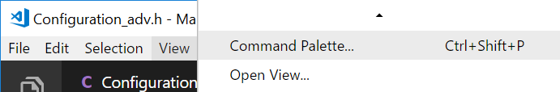
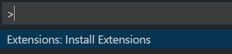
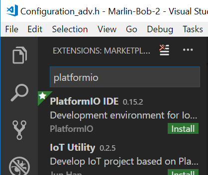
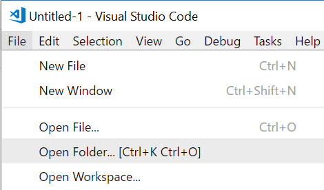
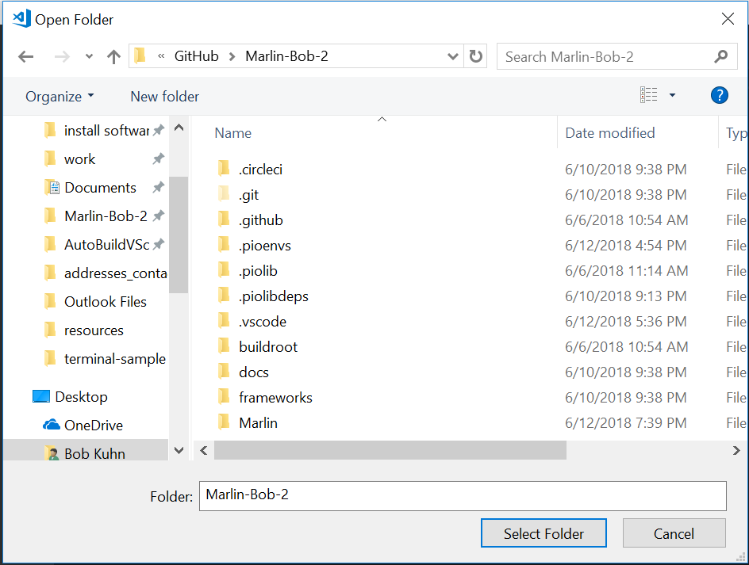
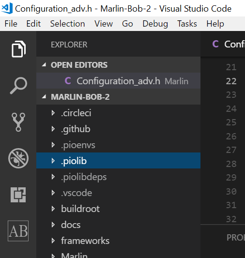
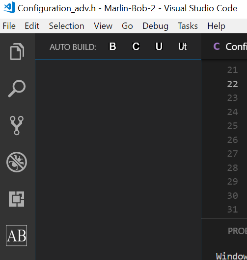
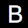
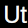

# Auto Build support for Visual Studio Code
This `Visual Studio Code` extension provides access to the `Auto Build` script.

## Installation

Get the MarlinFirmware repository from GitHub. Open the directory `buildroot/share/vscode` and copy the `AutoBuildMarlin` folder to the `Visual Studio Code` extension directory. Relaunch `Visual Studio Code` to complete the installation.

To find the `Visual Studio Code` extension directory:

- Windows - Use Windows Explorer's address bar to open `C:/Users/USERNAME/.vscode/extensions`.
- Mac - Use the Finder's `Go` menu to open `~/.vscode/extensions`.
- Linux - In the Terminal type `open ~/.vscode/extensions`.

### 3. Install the PlatformIO extension
Click on `View` > `Command Palette...`

Find and click on `Extensions: Install Extensions`

Type `platformio` into the search box and click on `Install` under `PlatformIO IDE`.

## Usage

This extension adds the Auto Build icon  to the Activities bar.

### 1. Open the Marlin folder
Click on `File` > `Open Folder...`

This brings up the `Open Folder` dialog. Select the folder that has the `platformio.ini` file in it.

You should see something like the following. If not, click on the Explorer icon in the Activities bar.

### 2. Click on the Auto Build Icon 
This brings up the Auto Build menu icon bar.

### 3. Click on one of the four icons
-  - Clicking on it starts `PIO Build`
-  - Clicking on it starts `PIO Clean`
-  - Clicking on it starts `PIO Upload`
-  - Clicking on it starts `PIO Upload (traceback)`
