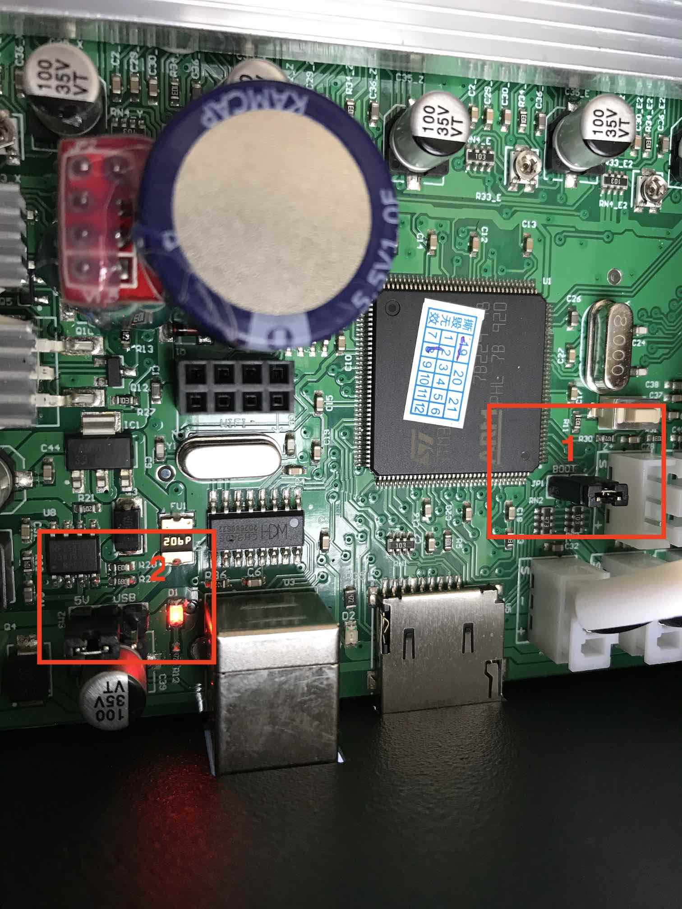

# Table of Contents <!-- omit in toc -->
- [Save Printer Settings (Optional, but recommended)](#save-printer-settings-optional-but-recommended)
- [Configuring Marlin for your Printer](#configuring-marlin-for-your-printer)
  - [1. Board Version](#1-board-version)
  - [2. Bed size](#2-bed-size)
  - [3. Stepper Drivers](#3-stepper-drivers)
  - [4. Steps / mm](#4-steps--mm)
  - [5. Other Marlin Config](#5-other-marlin-config)
- [Backup your Chitu Firmware (Optional, but strongly recommended)](#backup-your-chitu-firmare-optional-but-strongly-recommended)
- [Flashing Marlin JUST USING SD](#flashing-marlin-just-using-sd)
- [Flashing Marlin Firmware MANUALLY (OBSOLETE!)](#flashing-marlin-firmware-manually-obsolete)
- [Known Issues](#known-issues)

# Save Printer Settings (Optional, but recommended)

You can (OR MUST) dump the current settings of your printer. It may help you to figure out some configs, like steps/mm of your extruder.

1. Create a file named `savesettings.gcode` with the following content:
```
M6046 ; sdcard access
M8512 "currentconfig.gcode" ; save settings to file
```
2. Save it on the printer's SD card
3. Put the card in the printer and "print" this file
4. The printer won't do anything. Just wait a few seconds and stop the print.
5. Your current printer settings are stored in the file: `currentconfig.gcode`

You can read more about it in [this guide](https://www.facebook.com/notes/tronxy-turnigy-x5s-x5sa-x3s-3d-printer-drucker-users/tronxy-firmware-configuration-guide-by-keith-varin-addermk264bit-tuning/649799805579765/).

Thanks to KEITH VARIN.

# Configuring Marlin for your Printer

You need to edit `Configuration.h` to set up your printer.

## 1. Board Version

For ***V5*** and ***V8***

```cpp
// For V5 and V8
#define MOTHERBOARD BOARD_CHITU3D_V5
```

For ***V6***

```cpp
// For V6
#define MOTHERBOARD BOARD_CHITU3D_V6
```

## 2. Bed size

```cpp
// The size of the printable area
#define X_BED_SIZE 330
#define Y_BED_SIZE 330
...
#define Z_MAX_POS 400
```

## 3. Stepper Drivers

Some Pro models have TMC drivers. The non-Pro models have generic A4988 drivers.

Non-Pro (without TMC Drivers):

```cpp
/**
 * Stepper Drivers
 * ...
 */
#define X_DRIVER_TYPE  A4988
#define Y_DRIVER_TYPE  A4988
#define Z_DRIVER_TYPE  A4988
//#define X2_DRIVER_TYPE A4988
//#define Y2_DRIVER_TYPE A4988
//#define Z2_DRIVER_TYPE A4988
//#define Z3_DRIVER_TYPE A4988
//#define Z4_DRIVER_TYPE A4988
#define E0_DRIVER_TYPE A4988
//#define E1_DRIVER_TYPE A4988
//#define E2_DRIVER_TYPE A4988
//#define E3_DRIVER_TYPE A4988
//#define E4_DRIVER_TYPE A4988
//#define E5_DRIVER_TYPE A4988
//#define E6_DRIVER_TYPE A4988
//#define E7_DRIVER_TYPE A4988
```

Pro (with TMC Drivers):

```cpp
/**
 * Stepper Drivers
 * ...
 */
#define X_DRIVER_TYPE TMC2208_STANDALONE
#define Y_DRIVER_TYPE TMC2208_STANDALONE
#define Z_DRIVER_TYPE TMC2208_STANDALONE
//#define X2_DRIVER_TYPE A4988
//#define Y2_DRIVER_TYPE A4988
//#define Z2_DRIVER_TYPE A4988
//#define Z3_DRIVER_TYPE A4988
//#define Z4_DRIVER_TYPE A4988
#define E0_DRIVER_TYPE TMC2208_STANDALONE
//#define E1_DRIVER_TYPE A4988
//#define E2_DRIVER_TYPE A4988
//#define E3_DRIVER_TYPE A4988
//#define E4_DRIVER_TYPE A4988
//#define E5_DRIVER_TYPE A4988
//#define E6_DRIVER_TYPE A4988
//#define E7_DRIVER_TYPE A4988
```

## 4. Steps / mm

All machines have the same steps for X, Y and Z, and only extruder steps are different (Titan vs. normal).

***! This part can vary from machine to machine !***

One way to know the correct values is to read your `currentconfig.gcode` (saved later):

- `M8009` is the X and Y step/mm.
- `M8010` is the Z step/mm.
- `M8011` is the Extruder step/mm.

Example:

```gcode
M8009 S0.012500;x,y
M8010 S0.002500;z
M8011 S0.010799;e
```

Is equal to:

```gcode
x,y = 1 / 0.012500 = 80
z = 1 / 0.002500 = 400
e = 1 / 0.010799 = 92.60
```

So in Marlin:
```cpp
#define DEFAULT_AXIS_STEPS_PER_UNIT   { 80, 80, 400, 92.6 }
```

Check your values!

Normal non-TMC:
```cpp
/**
 * Default Axis Steps Per Unit (steps/mm)
 * Override with M92
 *                                      X, Y, Z, E0 [, E1[, E2...]]
 */
#define DEFAULT_AXIS_STEPS_PER_UNIT   { 80, 80, 400, 92.6 }
```
Titan Non-PRO:
```cpp
/**
 * Default Axis Steps Per Unit (steps/mm)
 * Override with M92
 *                                      X, Y, Z, E0 [, E1[, E2...]]
 */
#define DEFAULT_AXIS_STEPS_PER_UNIT   { 80, 80, 400, 420 }

// Extruder seems inverted on titan!
#define INVERT_E0_DIR true
```
Titan PRO (tmc):
```cpp
/**
 * Default Axis Steps Per Unit (steps/mm)
 * Override with M92
 *                                      X, Y, Z, E0 [, E1[, E2...]]
 */
#define DEFAULT_AXIS_STEPS_PER_UNIT   { 160, 160, 800, 764 }

// Extruder seems inverted on titan!
#define INVERT_E0_DIR true
```

## 5. Other Marlin Config

You can customize for your own setup. TFT, Baby Steps and a lot of cool stuff are already configured for you.

# Backup your Chitu Firmare (Optional, but strongly recommended)

1. Turn off your printer
2. Open your board case
3. Remove the "boot" jumper (1) as the image.
4. Change the "v source" jumper (2) from 5V to USB.
5. Open [STM Cube Programmer](https://www.st.com/en/development-tools/stm32cubeprog.html) (linux, mac, windows) or [FLASHER-STM32](https://www.st.com/en/development-tools/flasher-stm32.html) (only windows)
6. The size must be **512kb -> 0x80000**
7. Save the file. It must have exactly 524288 bytes (512kb)
8. Disconnect
10. Unplug USB cable
11. Put back the "boot" jumper (1).
12. Put back the "v source" jumper to 5V.


# Flashing Marlin JUST USING SD

Thanks to the amazing work of J.C. Nelson, now we can just use Marlin updating directly from SD!!

1. After you compile Marlin with the above instructions, it will generate a file: `YOUR-MARLIN-DIR/.pio/build/chitu_f103/update.cbd`
2. Turn off your printer
3. Copy the `update.cbd` file to SD card.
4. Put the SD card in your printer.
5. Power it on.
6. It will give some bips. After that, Marlin will start!

SIMPLE AS THAT!

Again, thanks to J.C. Nelson @xC000000

***If you already flashed Marlin the old way then you need restore your Chitu backup to use this method. This will make all your future installs easier.***

# Flashing Marlin Firmware MANUALLY (OBSOLETE!)

OBSOLETE! JUST USE THE FIRST METHOD.

1. Turn off the printer
2. Open the board case
3. Remove the "boot" jumper (1) as the image.
4. Change the V source jumper (2) from 5V to USB.
5. Open [STM Cube Programmer](https://www.st.com/en/development-tools/stm32cubeprog.html) (linux, mac, windows) or [FLASHER-STM32](https://www.st.com/en/development-tools/flasher-stm32.html) (only windows)
6. Flash the YOUR-MARLIN-DIR/.pio/build/chitu_f103/firmware.bin at 0x08000000
7. After the Flash is done, put the back the boot jumper (1) and the V source jumper to 5V.
8. Turn on the printer



# Known Issues

Some random V5 boards have a problem with the PIN that the Z-MIN Probe is connected to, causing the probe to appear triggered all the time. Due to this issue the probe always fails.

If you have this issue, edit the file: `Marlin/buildroot/share/PlatformIO/variants/CHITU_F103/wirish/boards_setup.cpp`

Change these lines:
```cpp
__weak void board_setup_gpio(void) {
    gpio_init_all();
}
```
To:
```cpp
__weak void board_setup_gpio(void) {
    GPIOA->regs->BSRR = (1U << PA14);
    gpio_init_all();
}
```

A patch may already have been applied to Marlin by the time you read this.
