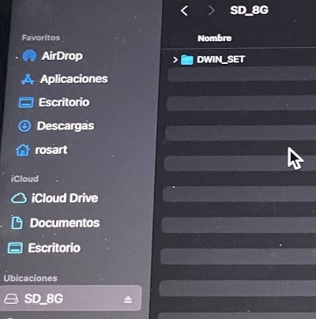

# Display firmware, boot image and icons compilations

## How to install
1. Get an µSD card of 8GB or less.
1. Format the µSD card with a 4 KB sector size
1. Copy the `DWIN_SET` directory in the Root of SD
1. Turn off your printer
1. Disconnect and dissasembly the screen unit
1. Install the µSD card into the slot of the screen unit
1. Reconnect the screen to the printer
1. Turn on the printer and wait for the display to change color from blue to
  orange
1. Verify that the screen assets were updated
1. Turn off the printer and remove the µSD card from the screen unit
1. Reassembly the screen unit  
  
If you want to change only the icons, then you can left only the **9.ICO** file
inside of the DWIN_SET folder.  
If you wasn't able to update the display, verify the format of the µSD Card
(FAT32 and allocation unit of 4096 bytes) and the CRC of the files.
  
  

Be sure to leave **only** the `DWIN_SET` folder at the root of the card.  
  
 
  
---

## [Giadej compilation](Giadej%20compilation/)

  
  
 
  
---

### Updating printer firmware
For update your printer firmware and get the latest version go here: <https://github.com/mriscoc/Marlin_Ender3v2/releases/latest>  

